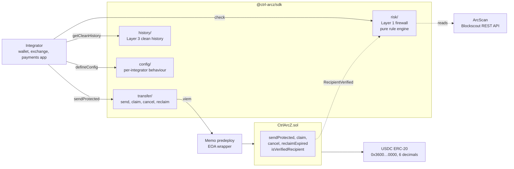
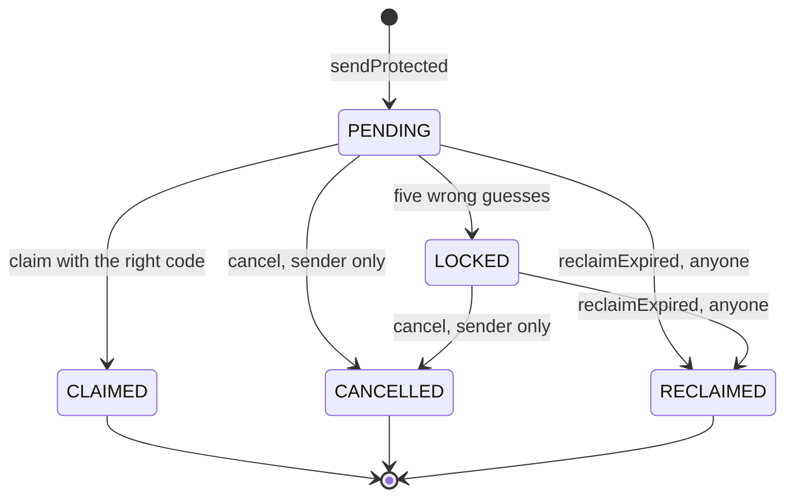
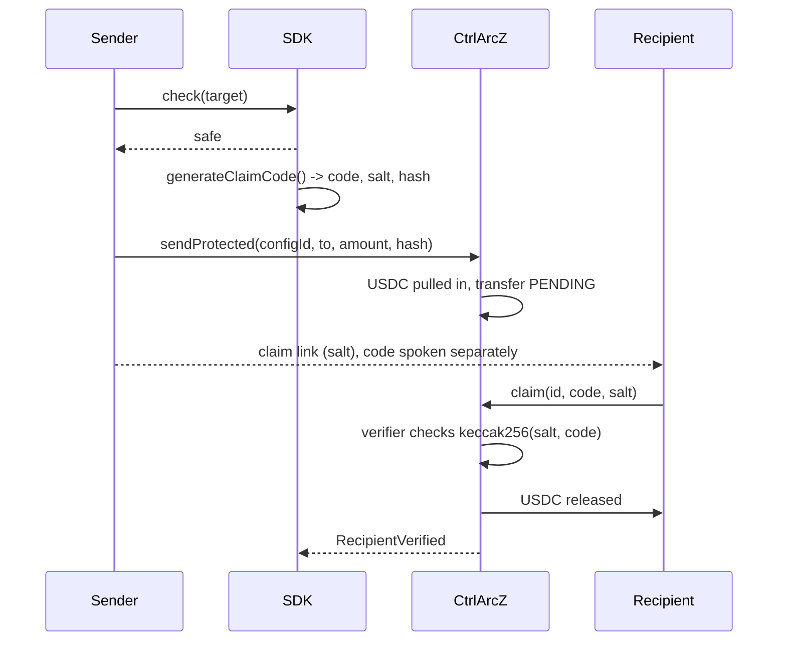
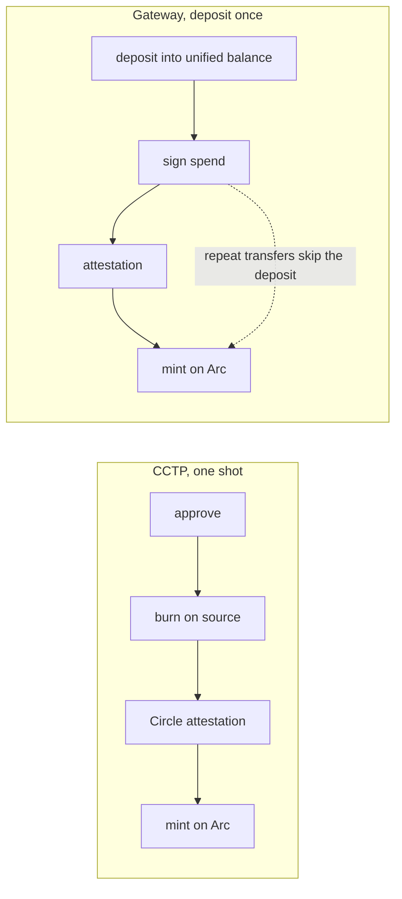

# Ctrl+ArcZ

**Refuse the bad send. Lock the good one. Return the money if nobody claims it.**

Protected USDC transfers on Arc: an SDK and a single contract that screen a payment before it is signed, hold it until the recipient proves they were meant to have it, and give it back to the sender if they never do.

[Turkish version](./README.tr.md)

## Contents

- [In one look](#in-one-look)
- [The problem](#the-problem)
- [How it compares](#how-it-compares)
- [System architecture](#system-architecture)
- [The three layers](#the-three-layers)
- [Flows by case](#flows-by-case)
- [Moving USDC in: CCTP or Gateway](#moving-usdc-in-cctp-or-gateway)
- [Why Arc](#why-arc)
- [Smart contracts](#smart-contracts)
- [Security](#security)
- [Tech stack](#tech-stack)
- [Repository layout](#repository-layout)
- [Getting started](#getting-started)
- [Known limits](#known-limits)

## In one look

|                |                                                                                       |
| -------------- | ------------------------------------------------------------------------------------- |
| **Network**    | Arc Testnet, chain id `5042002`                                                       |
| **Asset**      | USDC, which on Arc is both the gas token and the thing you are sending                |
| **Protection** | Pre-send risk firewall, code-gated claim, sender cancel, automatic expiry refund      |
| **Custody**    | None. Funds are with the user or in the contract. No owner, no pause, no upgrade path |
| **Product**    | An SDK any wallet, exchange or payments app embeds. Not another wallet                |
| **Tests**      | 61 Foundry tests (100 percent branch coverage), 53 SDK unit tests, live testnet runs  |

## The problem

Address poisoning is the fastest growing way to lose stablecoins, and it works because of a detail every wallet shares: addresses are shown abbreviated, as `0x64Ea…Fe3F`. The attacker grinds an address whose first and last characters match one you already pay, sends you a zero-value transfer from it so it lands in your transaction history, and waits. The next time you pay that counterparty you copy the address from your own history, and the two are indistinguishable.

The defining property is this: **the victim sends to the wrong address on purpose.** They are not tricked into signing something unexpected. They believe the address is correct, and everything downstream of that belief behaves normally.

That is why the ritual everyone performs before a large transfer, sending one dollar first and waiting for the recipient to confirm, does not help. The test transfer goes to the poisoned address too, and it confirms perfectly. You have paid twice, waited, and proven nothing.

It is also why an escrow on its own does not help. Locking the funds for the wrong recipient just locks them for the attacker.

Something has to refuse the send.

## How it compares

|                             | Stops the send | Funds recoverable after the fact | Needs an arbiter | Takes custody | Works for plain P2P |
| --------------------------- | -------------- | -------------------------------- | ---------------- | ------------- | ------------------- |
| Wallet address-book warning | No             | No                               | No               | No            | Yes                 |
| Poisoning detection service | Warns only     | No                               | No               | No            | Yes                 |
| Commerce escrow             | No             | Yes, by dispute                  | Yes              | Yes           | No                  |
| Circle Refund Protocol      | No             | Yes, by mediator                 | Yes              | Yes           | No                  |
| **Ctrl+ArcZ**               | **Yes**        | **Yes, by the sender**           | **No**           | **No**        | **Yes**             |

Circle's Refund Protocol solves a different problem on purpose. It is a commerce escrow built around an **arbiter** who sets the lockup window and authorizes refunds for buyer and seller disputes. Ctrl+ArcZ is P2P wrong-address safety: the sender holds the cancel right, the expiry refund is automatic, and no third party can move the money. Adding an arbiter would break the one property that makes a protected-transfer contract worth trusting.

Every Arc project we surveyed that locks funds does so in a commerce context: invoice links, freelance delivery, marketplace settlement. Transfer safety is a different shape, and it is the shape this SDK has.

## System architecture



One deployment, many tenants. An integrator calls `createConfig` once and gets a `configId` that encodes its own behaviour: recall window, claim mode, optional fee, minimum amount worth protecting. An exchange withdrawal screen and a P2P wallet can want very different things and still share this contract and this SDK.

## The three layers

### Layer 1: the firewall, before anything is signed

`check(sender, target)` returns a graded verdict. It is a pure rule engine, so the same input always produces the same verdict, with no network call inside the decision itself.

| Rule                 | Verdict   | Why                                                                                                    |
| -------------------- | --------- | ------------------------------------------------------------------------------------------------------ |
| `LOOKALIKE_ADDRESS`  | **block** | The target shares the first and last four hex characters with an address this sender has actually paid |
| `ZERO_VALUE_BAIT`    | **block** | The target sent this sender a zero-value transfer. Sending someone zero tokens has no other purpose    |
| `FRESH_ADDRESS`      | warning   | First seen less than 24 hours ago. Poisoning addresses are minted for the attack                       |
| `NEW_ADDRESS`        | warning   | No on-chain history at all                                                                             |
| `VERIFIED_RECIPIENT` | safe      | A protected transfer to this address settled before, claimed with a code                               |
| `KNOWN_COUNTERPARTY` | safe      | This exact address has been paid before                                                                |

Two properties matter more than the rule list.

**A positive signal never overrides a block.** An address you paid last week does not make its lookalike safe. That is the whole attack.

**The firewall fails closed.** If the sender's payment history cannot be fetched, the lookalike rule could not run, so a lookalike cannot be ruled out. An unverified target is blocked rather than downgraded to a warning the user clicks through. A firewall that waves traffic through when its data source is down is worse than no firewall, and the report is never silently marked safe.

**You do not have to remember to call it.** `sendProtected` runs the scan itself and throws `RiskBlockedError` before any funds move, so installing the SDK is what makes a send protected. A separate call an integrator can forget is not a defense.

<table>
<tr>
<td width="50%"></td>
<td width="50%"></td>
</tr>
<tr>
<td>A lookalike of an address this wallet has paid. The send button will not arm.</td>
<td>Verdicts are graded, and an incomplete scan is stated out loud rather than rounded down to safe.</td>
</tr>
</table>

### Layer 2: the protected transfer

The money is locked in the contract and released only against a proof the recipient holds.



The proof is split in two on purpose. The SDK mints a **six-digit code**, which the sender speaks to the recipient, and a **256-bit salt**, which travels in the claim link. The chain only ever sees `keccak256(salt, code)`. Six digits alone would be twenty bits of entropy and trivial to grind offline; the salt carries the real entropy, and the code carries the human step.

Two design decisions in the contract are worth knowing:

**A wrong code does not revert, it returns false.** An attempt limiter cannot be built on a reverting call, because the revert would roll back the very counter that records the failed guess, and the twenty-bit code could then be ground down on-chain for the price of gas. The failed attempt has to commit. `claim` returns a boolean and writes the attempt to storage; five wrong guesses freeze the transfer, and the SDK reads the receipt and throws `WrongClaimCodeError` rather than treating a mined transaction as a successful claim.

**Anyone may submit a claim, and the funds always go to the recipient recorded at send time.** That makes a claim front-run-safe (replaying a revealed proof merely settles the transfer for its intended recipient) and it is what makes the gasless path possible.

### Layer 3: a history worth trusting

Poisoning only works because the fake address is sitting in the victim's history, one tap from being copied. `getCleanHistory` removes that surface with two rules: drop zero-value transfers, and show only known tokens (a campaign usually mints a lookalike token so its row reads like a real USDC line). Nothing is deleted; the filtered rows are returned separately, so a UI can still offer "show spam" and the SDK stays honest about what it hid.

The layer then feeds back into layer 1. Every settled claim emits `RecipientVerified`, and those addresses are folded into the set the lookalike rule compares against. Pay someone once through a protected transfer, and from then on the firewall blocks their twin.

## Flows by case

### Case A: a protected send that settles



<table>
<tr>
<td width="33%"></td>
<td width="33%"></td>
<td width="33%"></td>
</tr>
<tr>
<td>Paste the recipient. The firewall runs as you type, on a debounce.</td>
<td>The funds are locked. The link carries the salt, the code is spoken.</td>
<td>The recipient claims, paying their own gas or letting a relayer pay.</td>
</tr>
</table>

<p></p>

Settlement is immediate, because Arc has sub-second deterministic finality. There is no pending limbo for the recipient to sit in.

### Case B: the firewall refuses

The poisoning tab in the demo does the whole attack in one click: it crafts a **real** lookalike of an address this wallet trusts (same first and last four hex characters, random middle), then runs the firewall against it.

<p></p>

Both addresses render as `0x64Ea…Fe3F` in any wallet. The firewall blocks the second one, and the send never happens.

### Case C: the sender changes their mind

`cancel` is available to the sender at any point before a claim lands, inside or outside the window, and even on a transfer that has been frozen by wrong guesses. Unclaimed money belongs to the sender, so there is no deadline on getting it back.

<p></p>

### Case D: the recipient never claims

When the recall window lapses, `reclaimExpired` returns the funds to the sender. It is callable by **anyone**, and the money can only ever go back to the sender. That is what makes the refund automatic: a recipient who disappears cannot strand the funds, and the sender does not have to be online at the right moment.

### Case E: the recipient holds no USDC at all

On Arc, gas is USDC, so a brand new recipient with an empty wallet cannot normally pay to claim. Because `claim` is permissionless and always pays the recorded recipient, a relayer can submit it and cover the gas. The recipient receives the full amount without ever sending a transaction. This is verified on-chain: a fresh, zero-balance, nonce-zero address received the whole transfer and its nonce stayed at zero.

In the demo the claim is signed server-side, so the relayer key never reaches the browser. The recipient just presses **Gasless**.

## Moving USDC in: CCTP or Gateway

A protected transfer needs USDC on Arc. Both of Circle's cross-chain routes are wired in, and the choice is a single tab.

<table>
<tr>
<td width="50%"></td>
<td width="50%"></td>
</tr>
<tr>
<td>Pick the route, the source and destination chain, and the amount.</td>
<td>The app says plainly which route fits which habit.</td>
</tr>
</table>

|                   | CCTP                                        | Gateway                                                 |
| ----------------- | ------------------------------------------- | ------------------------------------------------------- |
| Model             | Burn on the source, mint on the destination | Deposit once into a unified balance, then spend from it |
| First transfer    | About a minute                              | Deposit, then an instant spend                          |
| Repeat transfers  | About a minute, every time                  | About half a second, no deposit                         |
| Best for          | A one-off move                              | Sending often                                           |
| Chains on testnet | 11                                          | 5                                                       |
| Destination gas   | None needed, Circle forwards the mint       | None needed, Circle forwards the mint                   |



Gateway supports fewer chains than CCTP, so the pickers narrow themselves when you switch to it rather than offering a route that cannot run.

<table>
<tr>
<td width="50%"></td>
<td width="50%"></td>
</tr>
<tr>
<td>Gateway selected. The step list changes with the route.</td>
<td>Only the chains Gateway actually supports, searchable, with real network logos.</td>
</tr>
</table>

Both routes are signed **server-side** in the demo (`/api/bridge` and `/api/gateway`), because Circle's Bridge Kit and Unified Balance Kit are Node-first and a browser must never hold a signing key. In production an integrator runs the same functions from its own backend.

## Why Arc

The lock-then-claim mechanic needs two transactions. That is exactly what has kept it off other chains, and it is what Arc removes.

- **Gas is USDC, cheap and predictable.** The second transaction is economical, and there is no separate gas token to acquire before you can move your money.
- **Sub-second deterministic finality.** The transfer settles the moment the code is entered. The recipient never watches a spinner.
- **The primitives are already there.** Permit2 removes the per-send approve. CCTP and Gateway bring the USDC in. Circle publishes a refund primitive of its own. The pieces exist; what is missing is a product that puts refusal, locking, claiming and refunding into one flow.

## Smart contracts

| Contract              | Address                                                                                                                        | Role                                                      |
| --------------------- | ------------------------------------------------------------------------------------------------------------------------------ | --------------------------------------------------------- |
| **CtrlArcZ**          | [`0x8dAb7148cdc31DAcad6d7e12161AA3DEDb572Dca`](https://testnet.arcscan.app/address/0x8dAb7148cdc31DAcad6d7e12161AA3DEDb572Dca) | Config registry, protected transfers, verified recipients |
| **CodeClaimVerifier** | [`0x2C0f268DE2Aa8BB2ab27F2Ea5Ae8a0f9a0E068c4`](https://testnet.arcscan.app/address/0x2C0f268DE2Aa8BB2ab27F2Ea5Ae8a0f9a0E068c4) | Checks `keccak256(salt, code)` for `ClaimMode.CODE`       |
| USDC (Arc predeploy)  | `0x3600000000000000000000000000000000000000`                                                                                   | The asset, and the gas                                    |

Deploy block `51326557`. Nothing is deployed to mainnet, and nothing will be.

| Function                                    | Caller      | Purpose                                                          |
| ------------------------------------------- | ----------- | ---------------------------------------------------------------- |
| `createConfig(window, mode, feeBps, feeTo)` | Integrator  | Register a behaviour, get a deterministic `configId`             |
| `sendProtected(configId, to, amount, hash)` | Sender      | Lock USDC against a claim commitment                             |
| `sendProtectedWithPermit(..., signature)`   | Sender      | The same, pulled through Permit2, so no separate approve tx      |
| `claim(id, code, salt)`                     | Anyone      | Release to the recorded recipient. Returns false on a wrong code |
| `cancel(id)`                                | Sender only | Take the money back, any time before a claim lands               |
| `reclaimExpired(id)`                        | Anyone      | Refund an expired transfer. Only ever to the sender              |
| `isVerifiedRecipient(sender, recipient)`    | Anyone      | Layer 3, read by the firewall                                    |

The contract is **ownerless**: no owner, no pause, no proxy, no upgrade path, no admin function that can touch a locked transfer. A protected-transfer contract that an admin can drain protects nobody. There are 61 Foundry tests, including fuzz tests for value conservation, the fee split, cancel, and the property that a valid proof only ever pays the recorded recipient. Branch coverage is 100 percent.

## Security

The full audit lives in [`SECURITY.md`](./SECURITY.md). The short version:

- **No key is hardcoded anywhere.** Every signing key is read from the environment, and both Vite configs **refuse a production build** that would inline one, unless the operator explicitly acknowledges it.
- **The bridge and the gasless claim are signed server-side.** The browser posts the transfer id, code and salt, and never holds a relayer or Circle key.
- **The firewall fails closed** rather than degrading to "looks fine" when a data source is down.
- **Claim receipts are bound to the contract address and the exact transfer id**, so an unrelated or planted event in a batched receipt cannot decide a victim transfer's outcome.
- **Accepted tradeoff:** anyone can burn a transfer's five wrong-code attempts and freeze it. No funds are lost (the sender cancels and re-sends), and the alternative, counting attempts only for the recipient, would let an attacker grind the code for free from throwaway addresses.

## Tech stack

| Layer       | Choice                                                                |
| ----------- | --------------------------------------------------------------------- |
| Contract    | Solidity 0.8.24, Foundry, OpenZeppelin (SafeERC20, ReentrancyGuard)   |
| SDK         | TypeScript, viem, tsup (ESM, CJS and types), vitest                   |
| Risk data   | ArcScan (Blockscout REST), behind an `IDataProvider` seam             |
| Cross-chain | Circle CCTP via Bridge Kit, Circle Gateway via Unified Balance Kit    |
| Gasless     | Permissionless `claim` plus a relayer. Circle Gas Station in the demo |
| Approvals   | Permit2, for single-signature sends                                   |
| Demos       | React, Vite, a shared design system in `@ctrl-arcz/demo-kit`          |

## Repository layout

| Path                 | What                                                                    |
| -------------------- | ----------------------------------------------------------------------- |
| `packages/contracts` | `CtrlArcZ.sol`, `CodeClaimVerifier`, `IClaimVerifier`, Foundry tests    |
| `packages/sdk`       | `@ctrl-arcz/sdk`, the thing an integrator actually installs             |
| `packages/demo-kit`  | Shared wallet session, design system and the server-side bridge helpers |
| `apps/sender`        | Sender demo, port 5173                                                  |
| `apps/receiver`      | Recipient claim page, port 5174                                         |
| `examples`           | A standalone Node quickstart, no framework                              |

Every address, RPC and chain constant lives in exactly one file, `packages/sdk/src/chains/arcTestnet.ts`. The Foundry deploy script reads a JSON file generated from it, so no address is written down twice.

## Getting started

```bash
git clone --recurse-submodules https://github.com/Farukest/Ctrl-ArcZ.git
cd Ctrl-ArcZ
pnpm install

cp .env.example .env      # fill in throwaway testnet wallets
```

USDC is both gas and the asset on Arc, so fund the wallets with Arc Testnet USDC from [faucet.circle.com](https://faucet.circle.com). Foundry is required for the contract: <https://getfoundry.sh>

| Command               | What it does                            |
| --------------------- | --------------------------------------- |
| `pnpm build`          | Build every package                     |
| `pnpm test`           | Foundry plus vitest                     |
| `pnpm contracts:test` | Contract tests only                     |
| `pnpm deploy:testnet` | Deploy `CtrlArcZ` to Arc Testnet        |
| `pnpm dev:sender`     | Sender demo on http://localhost:5173    |
| `pnpm dev:receiver`   | Recipient demo on http://localhost:5174 |

Using the SDK is three calls, and the firewall is one of them whether you ask for it or not:

```ts
import {
  defineConfig,
  registerConfig,
  generateClaimCode,
  approveUsdc,
  sendProtected,
  RiskBlockedError,
} from '@ctrl-arcz/sdk';

const config = defineConfig({ recallWindow: 3600 });
const { configId } = await registerConfig(clients, config);
const secret = generateClaimCode(); // code, salt, claimHash

await approveUsdc(clients, amount);

try {
  // Layer 1 runs inside this call. A lookalike or a zero-value baiter throws
  // before a single unit of USDC moves. There is no separate call to forget.
  const { transferId } = await sendProtected(
    clients,
    { configId, to: recipient, amount, claimHash: secret.claimHash },
    { config },
  );
} catch (e) {
  if (e instanceof RiskBlockedError) showRiskCard(e.report);
  else throw e;
}
```

The recipient claims with `claim(clients, transferId, code, salt)`. The sender can `cancel(clients, transferId)` at any time before that. Full signatures, and how to reuse a report your own UI already fetched, are in [`packages/sdk/README.md`](./packages/sdk/README.md).

The demos run without MetaMask if you drop a `.env.local` into each app; the wallet is then a local test signer that still broadcasts real transactions to Arc Testnet. See [`.env.example`](./.env.example).

## Known limits

- The contract has not been audited. Testnet only.
- The firewall depends on a single indexer (ArcScan). If it cannot be reached, the report degrades to a warning, or to a block when a lookalike cannot be ruled out. It never degrades to safe.
- The lookalike in the poisoning scenario is constructed rather than ground out of a keypair. The firewall decides from the address alone, so no private key is needed to prove that it blocks a genuine lookalike.
- Anyone can freeze a pending transfer by burning its five attempts. Funds stay safe; the sender cancels and re-sends.
