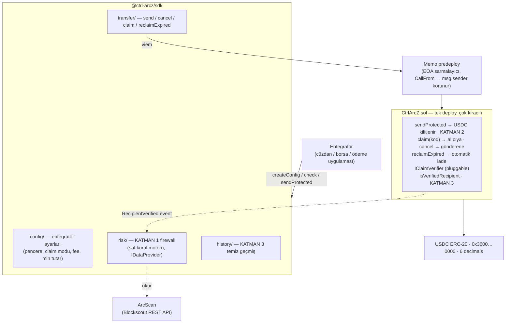

# Ctrl+ArcZ

**Korumalı USDC transferi için SDK + tek akıllı kontrat, Arc üzerinde.** Bir gönderimi zincire yazmadan önce risk taramasından geçirir, parayı alıcı doğru kodu girene kadar kontratta kilitler, gönderene her an iptal hakkı verir ve alıcı hiç claim etmezse parayı otomatik iade eder.

Kripto'da yanlış adrese giden para geri gelmez ve bunun en hızlı büyüyen biçimi **address poisoning**'dir: saldırgan, kurbanın sık kullandığı adresin ilk ve son karakterleriyle aynı görünen sahte bir adres üretir (cüzdanlar adresin ortasını `0x3A5f…9C2b` diye gizlediği için fark edilmez), bu adresten kurbana 0 değerli bir transfer atarak kendini kurbanın işlem geçmişine sokar ve kurban bir sonraki gönderimde adresi geçmişten kopyalar. Ocak 2026'da ayda 3,4 milyon poisoning denemesi kaydedildi; Aralık 2025'te bir kurban, test transferinden 26 dakika sonra geçmişten sahte adresi kopyalayarak 50 milyon dolar kaybetti. Bugün büyük tutar gönderen herkesin yaptığı "önce 1 dolarlık test transferi at, onayı bekle, sonra kalanını gönder" ritüeli yavaş, çift maliyetli ve poisoning'e karşı **işe yaramaz** — çünkü test transferi de sahte adrese gider ve sorunsuz onaylanır.

Ctrl+ArcZ bu ritüeli öldürür: tutarın tamamını tek işlemde gönderirsin, para kontratta kilitlenir, alıcı kodu girdiği anda saniye altında settle olur. Kodu bilmeyen (yani sahte adresin sahibi olan) hiç kimse parayı alamaz ve süre dolunca para gönderene döner. Ürün bir cüzdan ya da uygulama değil; **herhangi bir cüzdanın, borsanın veya ödeme uygulamasının kendi arayüzüne gömebileceği bir SDK'dır**.

## Koruma üç katmandan oluşur

| #   | Katman                               | Nerede                                                            | Ne yapar                                                                                                                                                                                                                         |
| --- | ------------------------------------ | ----------------------------------------------------------------- | -------------------------------------------------------------------------------------------------------------------------------------------------------------------------------------------------------------------------------- |
| 1   | **Gönderim öncesi firewall**         | SDK `risk.check()`                                                | Asıl koruma budur. Poisoning'de kullanıcı yanlış adrese _bilerek_ (doğru sandığı için) gönderir; parayı escrow'da bekletmek onu kurtarmaz. Benzer-adres / taze-adres / 0-değerli-transfer kontrolü gönderimden **önce** bloklar. |
| 2   | **Kod ile claim**                    | Kontrat `sendProtected` → `claim`                                 | Para çıplak adrese değil, kodu bilen alıcıya gider. Sahte adresin sahibi kodu bilemez, claim edemez; süre dolunca para otomatik döner. Gönderen dilediği an `cancel` edebilir.                                                   |
| 3   | **Temiz geçmiş + doğrulanmış alıcı** | SDK `history.getCleanHistory()` + kontrat `isVerifiedRecipient()` | 0-değerli ve spam-token satırları geçmişten filtrelenir (saldırının çalıştığı yüzey yok edilir). İlk başarılı claim'den sonra alıcı "doğrulanmış kayıt" olur; bir daha adres kopyalama işi yaşanmaz.                             |

## Neden Arc, neden şimdi

Bu fikir yeni değil: 2020'de **Kirobo**, Ethereum'da "Undo Button" adıyla geri alınabilir transfer denedi ve öldü. Ölüm sebepleri netti — mekanik iki işlem gerektiriyor (kilitle + claim) ve o dönemin Ethereum gas'ında bu pahalıydı; ürün kendi token'ına zorluyordu; ve 2020'de poisoning henüz kimsenin gündeminde değildi.

Arc bu üç sebebi de ortadan kaldırıyor:

- **Gas USDC cinsinden, ucuz ve öngörülebilir.** İki işlemli mekanik artık ekonomik. Ayrıca ayrı bir gas token'ı edinme sürtünmesi yok.
- **Saniye altı deterministik kesinlik** (Malachite konsensüsü). Claim anında para settle olur; alıcı "beklemede" hissi yaşamaz.
- **Circle'ın kendisi geri alınabilirlik yönünde çalışıyor** (Refund Protocol'ü açık kaynak yayınladı), ama tüketici ürünü yapmıyor. Zemin döşenmiş; ürün boşluğu burada.

> **Refund Protocol'den farkımız (bilinçli):** Circle'ın Refund Protocol'ü bir **arbiter** (aracı) etrafında kurulu ticari **anlaşmazlık çözümü** escrow'u — alıcı-satıcı disputeleri (mal teslim edilmedi vb.) için, mediator lockup penceresi belirleyip iade yetkilendiriyor. Bizimki P2P **yanlış-adres güvenliği**: **arbiter yok, custody yok**, gönderen-kontrollü iptal + otomatik iade. Circle'ın kendi iade primitifi bile arbiter-tabanlı/ticariyken bizimkinin arbiter'sız/P2P olması, konumlanmamızın farkını doğruluyor — üstüne inşa etmedik çünkü bir güvenilir aracı eklemek "custody yok" tezimizi bozardı.

Dürüst çerçeve: bu "kimsenin aklına gelmemiş fikir" değil. Poisoning **tespiti** yapan servisler (Blockaid vb.) dünyada var. Bizim iddiamız, tespit + kilit + claim + iade akışını tek pakette birleştiren ve **Arc'ta bu konumlanmayla çıkan ilk ve tek** proje olmak. (Arc hackathonları ve GitHub tarandı: Arc'taki escrow projelerinin tamamı ticaret bağlamında — fatura linki, freelance teslimi, marketplace. "P2P transfer güvenliği" konumlanmasıyla çıkan sıfır proje var.)

Bilinçli olarak **yapmadıklarımız**: AI/agent katmanı yok (transfer kararı deterministik iştir; araya LLM koymak güvenlik eklemez, prompt injection yüzeyi açar — risk motoru saf kural motorudur), custody yok (para ya kullanıcıda ya kontratta), kendi token'ı yok.

## Mimari



Katman 3, katman 1'i besler: bir kez korumalı ödeme yaptığın (doğrulanmış) adresin ikizi de firewall tarafından bloklanır.

**Tek kontrat, çok kiracı.** Kontrat herkese açıktır; her entegratör `createConfig` ile kendi davranışını tanımlar: recall penceresi (0 sn – 7 gün), claim yöntemi, risk eşiği davranışı, `minProtectedAmount`, opsiyonel kendi fee'si. Bir borsa "24 saat pencere + yalnız kayıtlı alıcı" kurar; bir P2P cüzdanı "60 saniye + 6 haneli kod" kurar; ikisi aynı kontratı ve aynı SDK'yı kullanır.

## Yapı

| Paket                | Ne                                                                                                |
| -------------------- | ------------------------------------------------------------------------------------------------- |
| `packages/contracts` | `CtrlArcZ.sol` + `CodeClaimVerifier` + `IClaimVerifier` + Foundry testleri (61) + deploy script'i |
| `packages/sdk`       | `@ctrl-arcz/sdk` — viem tabanlı TypeScript SDK (ESM + CJS + tipler), npm'e hazır                  |
| `packages/demo-kit`  | İki demo app'in paylaştığı cüzdan/session altyapısı (duplikasyon yok)                             |
| `apps/sender`        | Demo: gönderen tarafı entegrasyonu (port 5173)                                                    |
| `apps/receiver`      | Demo: alıcı claim sayfası (port 5174)                                                             |
| `examples/`          | Bağımsız çalışan Node quickstart'ı (SDK'yı sıfırdan kullanma örneği)                              |

Tüm adresler, RPC ve chain bilgisi **tek bir dosyada** durur: `packages/sdk/src/chains/arcTestnet.ts`. Kontrat deploy script'i dahil herkes oradan okur; hiçbir yerde adres hardcode edilmez.

## Kurulum

```bash
git clone --recurse-submodules <repo>
cd Ctrl+ArcZ
pnpm install

cp .env.example .env      # cüzdanları doldur (cast wallet new ile üretebilirsin)
```

Arc'ta **USDC hem gas hem transfer varlığıdır**; cüzdanları [faucet.circle.com](https://faucet.circle.com) üzerinden Arc Testnet USDC ile fonla.

Foundry gerekli: <https://getfoundry.sh>

## Komutlar

| Komut                       | Ne yapar                                        |
| --------------------------- | ----------------------------------------------- |
| `pnpm build`                | Tüm paketleri derler (kontrat + SDK + iki demo) |
| `pnpm test`                 | Tüm testler (Foundry + vitest)                  |
| `pnpm contracts:test`       | Yalnız kontrat testleri (`forge test`)          |
| `pnpm deploy:testnet`       | `CtrlArcZ`'yi Arc Testnet'e deploy eder         |
| `pnpm dev:sender`           | Gönderen demosu → http://localhost:5173         |
| `pnpm dev:receiver`         | Alıcı demosu → http://localhost:5174            |
| `pnpm lint` / `pnpm format` | ESLint / Prettier                               |

### Demoları çalıştırma (test modu)

Demolar MetaMask ile de çalışır; MetaMask'sız (headless / hızlı deneme) test modu için her app'in klasörüne `.env.local` koy:

```ini
# apps/sender/.env.local
VITE_DEMO_PK=0x<SENDER_private_key>
VITE_DEMO_RECEIVER=0x<RECEIVER_address>   # poisoning demosunun "güvenilen adresi"
VITE_RECEIVER_URL=http://localhost:5174

# apps/receiver/.env.local
VITE_DEMO_PK=0x<RECEIVER_private_key>
```

Test modu **gerçek zincire gerçek tx atar** — yalnızca imza MetaMask yerine yerel key ile yapılır. `.env.local` gitignore'dadır.
