# Ctrl+ArcZ

**Refuse the bad send. Lock the good one. Return the money if nobody claims it.**

[](https://www.youtube.com/watch?v=fcgyqBUbkcg) [](https://ctrlarcz.xyz) [](https://play.google.com/apps/testing/com.xyz.ctrlarcz) [](https://docs.ctrlarcz.xyz) [](https://testnet.arcscan.app/address/0x8dAb7148cdc31DAcad6d7e12161AA3DEDb572Dca) [](#tech-stack) [](#security)

Protected USDC transfers on Arc: an SDK and a single contract that screen a payment before it is signed, hold it until the recipient proves they were meant to have it, and give it back to the sender if they never do.

[Turkish version](./README.tr.md)

## Contents

- [In one look](#in-one-look)
- [The problem](#the-problem)
- [How it compares](#how-it-compares)
- [System architecture](#system-architecture)
- [The three layers](#the-three-layers)
- [Flows by case](#flows-by-case)
- [Moving USDC in: CCTP or Gateway](#moving-usdc-in-cctp-or-gateway)
- [Why Arc](#why-arc)
- [Smart contracts](#smart-contracts)
- [Security](#security)
- [Tech stack](#tech-stack)
- [Repository layout](#repository-layout)
- [Getting started](#getting-started)
- [Subscriptions and agent wallets](#subscriptions-and-agent-wallets)
- [The keeper: an agent with a wallet, bounded by the chain](#the-keeper-an-agent-with-a-wallet-bounded-by-the-chain)
- [The investigator: the judgement a rule cannot make](#the-investigator-the-judgement-a-rule-cannot-make)
- [Known limits](#known-limits)

## In one look

|                |                                                                                       |
| -------------- | ------------------------------------------------------------------------------------- |
| **Network**    | Arc Testnet, chain id `5042002`                                                       |
| **Asset**      | USDC, which on Arc is both the gas token and the thing you are sending                |
| **Protection** | Pre-send risk firewall, code-gated claim, sender cancel, automatic expiry refund      |
| **Custody**    | None. Funds are with the user or in the contract. No owner, no pause, no upgrade path |
| **Product**    | An SDK any wallet, exchange or payments app embeds. Not another wallet                |
| **Tests**      | 528 in total: 99 Foundry, 346 SDK, 50 demo-kit, 33 keeper, plus live testnet runs |

## The problem

Address poisoning is the fastest growing way to lose stablecoins, and it works because of a detail every wallet shares: addresses are shown abbreviated, as `0x64Ea…Fe3F`. The attacker grinds an address whose first and last characters match one you already pay, sends you a zero-value transfer from it so it lands in your transaction history, and waits. The next time you pay that counterparty you copy the address from your own history, and the two are indistinguishable.

The defining property is this: **the victim sends to the wrong address on purpose.** They are not tricked into signing something unexpected. They believe the address is correct, and everything downstream of that belief behaves normally.

That is why the ritual everyone performs before a large transfer, sending one dollar first and waiting for the recipient to confirm, does not help. The test transfer goes to the poisoned address too, and it confirms perfectly. You have paid twice, waited, and proven nothing.

It is also why an escrow on its own does not help. Locking the funds for the wrong recipient just locks them for the attacker.

Something has to refuse the send.

## How it compares

|                             | Stops the send | Funds recoverable after the fact | Needs an arbiter | Takes custody | Works for plain P2P |
| --------------------------- | -------------- | -------------------------------- | ---------------- | ------------- | ------------------- |
| Wallet address-book warning | No             | No                               | No               | No            | Yes                 |
| Poisoning detection service | Warns only     | No                               | No               | No            | Yes                 |
| Commerce escrow             | No             | Yes, by dispute                  | Yes              | Yes           | No                  |
| Circle Refund Protocol      | No             | Yes, by mediator                 | Yes              | Yes           | No                  |
| **Ctrl+ArcZ**               | **Yes**\*      | **Yes, by the sender**           | **No**           | **No**        | **Yes**             |

\* Blocks by default, and stops the send in the SDK as well as the UI. A user who insists can get past it, but only by looking at the two addresses side by side first, and the money is still recoverable if they were wrong. See [the escape hatch](#layer-1-the-firewall-before-anything-is-signed).

Circle's Refund Protocol solves a different problem on purpose. It is a commerce escrow built around an **arbiter** who sets the lockup window and authorizes refunds for buyer and seller disputes. Ctrl+ArcZ is P2P wrong-address safety: the sender holds the cancel right, the expiry refund is automatic, and no third party can move the money. Adding an arbiter would break the one property that makes a protected-transfer contract worth trusting.

Most contracts that lock stablecoins are built for commerce: invoice links, freelance delivery, marketplace settlement. All of them assume the parties know each other and are arguing about delivery. Wrong-address safety assumes the opposite, and needs a different shape.

## System architecture

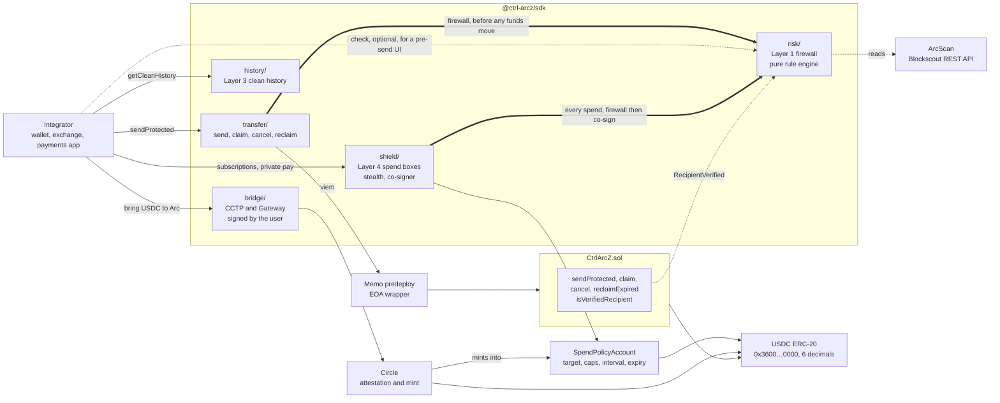
```mermaid
flowchart LR
    I["Integrator<br/>wallet, exchange, payments app"]

    subgraph SDK["@ctrl-arcz/sdk"]
        RISK["risk/<br/>Layer 1 firewall<br/>pure rule engine"]
        TR["transfer/<br/>send, claim, cancel, reclaim"]
        HIST["history/<br/>Layer 3 clean history"]
        SHIELD["shield/<br/>Layer 4 spend boxes<br/>stealth, co-signer"]
        BRIDGE["bridge/<br/>CCTP and Gateway<br/>signed by the user"]
    end

    SCOUT["ArcScan<br/>Blockscout REST API"]
    MEMO["Memo predeploy<br/>EOA wrapper"]
    CIRCLE["Circle<br/>attestation and mint"]

    subgraph C["CtrlArcZ.sol"]
        SM["sendProtected, claim,<br/>cancel, reclaimExpired<br/>isVerifiedRecipient"]
    end

    BOX["SpendPolicyAccount<br/>target, caps, interval, expiry"]
    USDC["USDC ERC-20<br/>0x3600…0000, 6 decimals"]

    I -->|sendProtected| TR
    TR ==>|firewall, before any funds move| RISK
    I -.->|check, optional, for a pre-send UI| RISK
    I -->|getCleanHistory| HIST
    I -->|subscriptions, private pay| SHIELD
    I -->|bring USDC to Arc| BRIDGE
    RISK -.->|reads| SCOUT
    TR -->|viem| MEMO
    MEMO --> C
    C --> USDC
    SHIELD ==>|every spend, firewall then co-sign| RISK
    SHIELD --> BOX
    BOX --> USDC
    BRIDGE --> CIRCLE
    CIRCLE -->|mints into| BOX
    CIRCLE --> USDC
    SM -.->|RecipientVerified| RISK
```

One deployment, many tenants. An integrator calls `createConfig` once and gets a `configId` that encodes its own behaviour: recall window, claim mode, optional fee, minimum amount worth protecting. An exchange withdrawal screen and a P2P wallet can want very different things and still share this contract and this SDK.

## The three layers

### Layer 1: the firewall, before anything is signed

`check(sender, target)` returns a graded verdict. It is a pure rule engine, so the same input always produces the same verdict, with no network call inside the decision itself.

| Rule                 | Verdict   | Why                                                                                                    |
| -------------------- | --------- | ------------------------------------------------------------------------------------------------------ |
| `LOOKALIKE_ADDRESS`  | **block** | The target shares the first and last four hex characters with an address this sender has actually paid |
| `ZERO_VALUE_BAIT`    | **block** | The target sent this sender a zero-value transfer. Sending someone zero tokens has no other purpose    |
| `FRESH_ADDRESS`      | warning   | First seen less than 24 hours ago. Poisoning addresses are minted for the attack                       |
| `NEW_ADDRESS`        | warning   | No on-chain history at all                                                                             |
| `VERIFIED_RECIPIENT` | safe      | A protected transfer to this address settled before, claimed with a code                               |
| `KNOWN_COUNTERPARTY` | safe      | This exact address has been paid before                                                                |

Two properties matter more than the rule list.

**A positive signal never overrides a block.** An address you paid last week does not make its lookalike safe. That is the whole attack.

**The firewall fails closed.** If the sender's payment history cannot be fetched, the lookalike rule could not run, so a lookalike cannot be ruled out. An unverified target is blocked rather than downgraded to a warning the user clicks through. A firewall that waves traffic through when its data source is down is worse than no firewall, and the report is never silently marked safe.

**You do not have to remember to call it.** `sendProtected` runs the scan itself and throws `RiskBlockedError` before any funds move, so installing the SDK is what makes a send protected. A separate call an integrator can forget is not a defense.

<table>
<tr>
<td width="50%">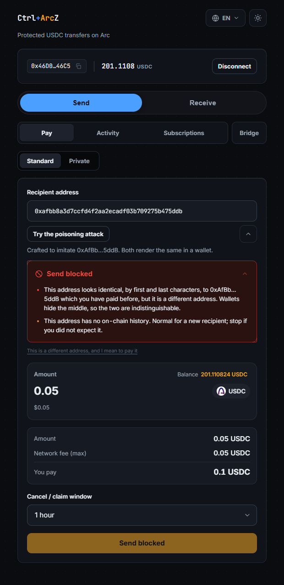</td>
<td width="50%">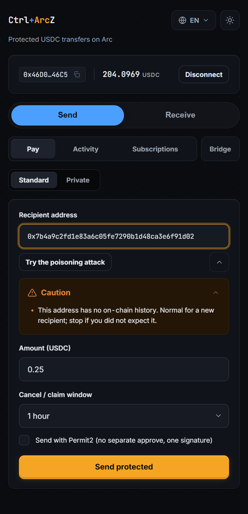</td>
</tr>
<tr>
<td>A lookalike of an address this wallet has paid. The send button will not arm.</td>
<td>Verdicts are graded, and an incomplete scan is stated out loud rather than rounded down to safe.</td>
</tr>
</table>

**A refusal is not a dead end.** A rule engine can be wrong about a real payment: the lookalike rule fires on eight matching hex characters, which two unrelated addresses can share by accident, and the zero-value rule fires on a transfer anyone can send you. A block you cannot get past means the app sometimes simply cannot pay a colleague, so there is a way through, and its shape is the whole point. Not a button beside the refusal, which the one person it must stop would press without reading: the escape hatch **is** the comparison. Both addresses are shown in full, one above the other, with the four characters at each end dimmed and the differing middle left bright, because those four characters at each end are exactly what every wallet abbreviates to and exactly what the attacker matched. A victim sees it. A false positive glances and moves on.

Only then is there a checkbox, and only then a button. And the decision has to survive the SDK, which runs its own guard and re-scans: it takes the verdict the user actually looked at, not a flag, so it cannot be reused for another recipient, cannot outlive the session, and cannot carry through a verdict that got worse or gained a reason while the user was deciding. The UI cannot grant permission the SDK has not agreed to.

The cost of being wrong is bounded here in a way it is not in a browser's "proceed anyway": the money goes into the contract behind a claim code, the sender can cancel it at any time, and it comes back on its own when the window lapses. Verified end to end on Arc testnet: a lookalike blocked, overridden through the comparison, sent, and cancelled back to the sender. On the bridge, where there is no recall, the same panel says so instead.

**Every path that moves money runs it.** Sending, bridging to someone else, paying privately and authorising a subscription all take an address a person typed, so all four run the same check against one policy, from one module, and none of them arms its button until the answer is in. That last clause is stricter than it sounds: a verdict that is still forming is not a verdict, and a screen that arms while the scan is running can dispatch a payment that the answer would have stopped. The same rule decides for all of them, so a new way to send cannot quietly ship with a weaker door.

<p>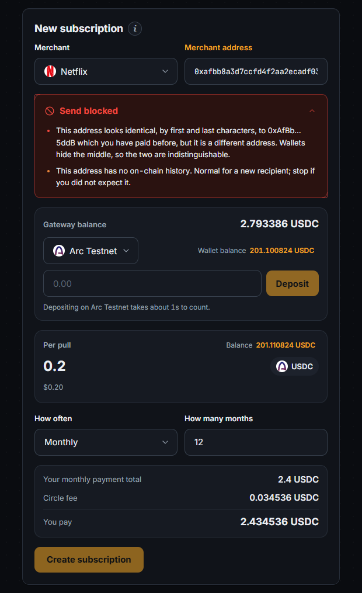</p>

A subscription is not one payment to an address, it is standing permission to pull from a funded box on a schedule, so the address matters more here than anywhere. The verdict lands under the field while you are still typing, and the create button never arms.

### Layer 2: the protected transfer

The money is locked in the contract and released only against a proof the recipient holds.

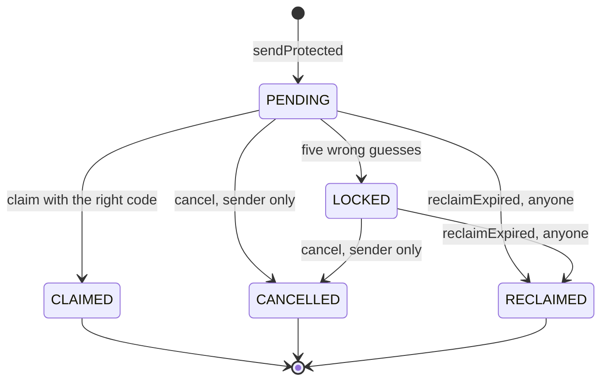
```mermaid
stateDiagram-v2
    [*] --> PENDING: sendProtected
    PENDING --> CLAIMED: claim with the right code
    PENDING --> LOCKED: five wrong guesses
    PENDING --> CANCELLED: cancel, sender only
    LOCKED --> CANCELLED: cancel, sender only
    PENDING --> RECLAIMED: reclaimExpired, anyone
    LOCKED --> RECLAIMED: reclaimExpired, anyone
    CLAIMED --> [*]
    CANCELLED --> [*]
    RECLAIMED --> [*]
```

The proof is a **single 80-bit code**, sixteen characters the sender hands to the recipient: `A4K7-9QMX-2PR6-TH8D`. The chain only ever sees its hash.

Two decisions are behind that shape. **It has to survive an offline brute force**, because in a poisoning attack the recipient recorded on-chain is the attacker: they hold the hash and can grind it for as long as they like. A six-digit code is twenty bits, a million guesses, milliseconds of work. **And it has to travel as one piece.** Splitting the proof and delivering half of it by address, in a link the app fetches, in an on-chain ciphertext, through a backend, hands that half to the attacker too, because the address is theirs. The code reaches a person through a channel the attacker is not in, and that is the whole of the second factor.

The alphabet is Crockford base32, so there is no I, L, O or U to confuse with 1 and 0, and what the recipient types is normalised before it is checked.

Two design decisions in the contract are worth knowing:

**A wrong code does not revert, it returns false.** An attempt limiter cannot be built on a reverting call, because the revert would roll back the very counter that records the failed guess, and the twenty-bit code could then be ground down on-chain for the price of gas. The failed attempt has to commit. `claim` returns a boolean and writes the attempt to storage; five wrong guesses freeze the transfer, and the SDK reads the receipt and throws `WrongClaimCodeError` rather than treating a mined transaction as a successful claim.

**Anyone may submit a claim, and the funds always go to the recipient recorded at send time.** That makes a claim front-run-safe (replaying a revealed proof merely settles the transfer for its intended recipient) and it is what makes the gasless path possible.

### Layer 3: a history worth trusting

Poisoning only works because the fake address is sitting in the victim's history, one tap from being copied. `getCleanHistory` removes that surface with two rules: drop zero-value transfers, and show only known tokens (a campaign usually mints a lookalike token so its row reads like a real USDC line). Nothing is deleted; the filtered rows are returned separately, so a UI can still offer "show spam" and the SDK stays honest about what it hid.

The layer then feeds back into layer 1. Every settled claim emits `RecipientVerified`, and those addresses are folded into the set the lookalike rule compares against. Pay someone once through a protected transfer, and from then on the firewall blocks their twin.

## Flows by case

### Case A: a protected send that settles

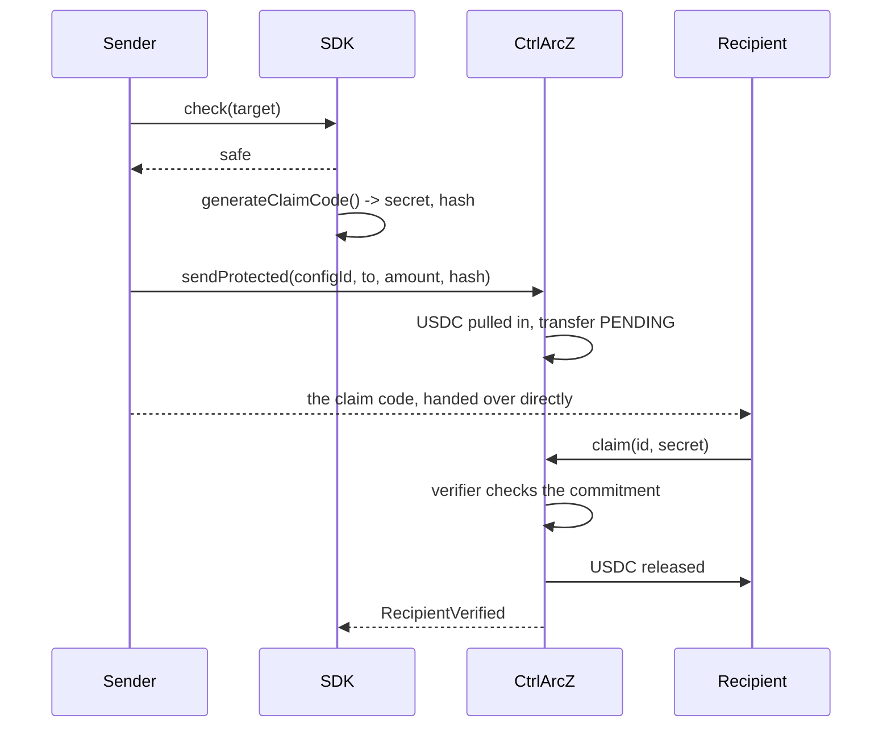
```mermaid
sequenceDiagram
    participant S as Sender
    participant SDK as SDK
    participant C as CtrlArcZ
    participant R as Recipient

    S->>SDK: check(target)
    SDK-->>S: safe
    SDK->>SDK: generateClaimCode() -> secret, hash
    S->>C: sendProtected(configId, to, amount, hash)
    C->>C: USDC pulled in, transfer PENDING
    S-->>R: the claim code, handed over directly
    R->>C: claim(id, secret)
    C->>C: verifier checks the commitment
    C->>R: USDC released
    C-->>SDK: RecipientVerified
```

<table>
<tr>
<td width="33%">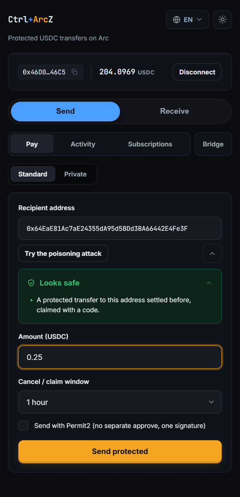</td>
<td width="33%">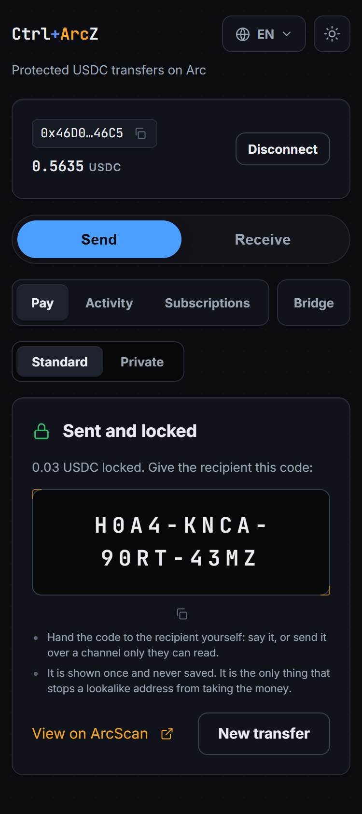</td>
<td width="33%">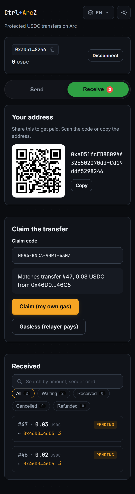</td>
</tr>
<tr>
<td>Paste the recipient. The firewall runs as you type, on a debounce.</td>
<td>The funds are locked. One code comes out, and it is shown once.</td>
<td>The recipient claims, paying their own gas or letting a relayer pay.</td>
</tr>
</table>

<table>
<tr>
<td width="50%">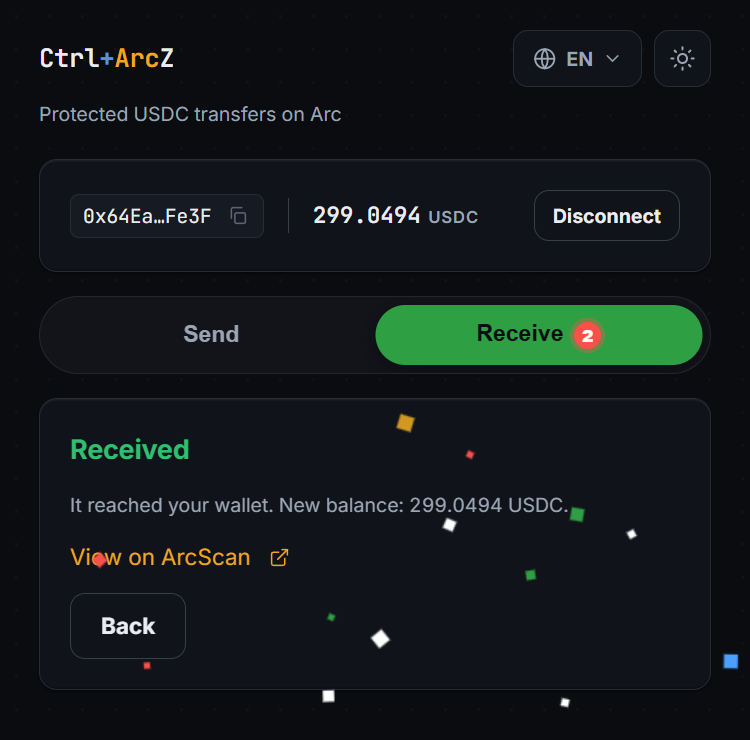</td>
<td width="50%">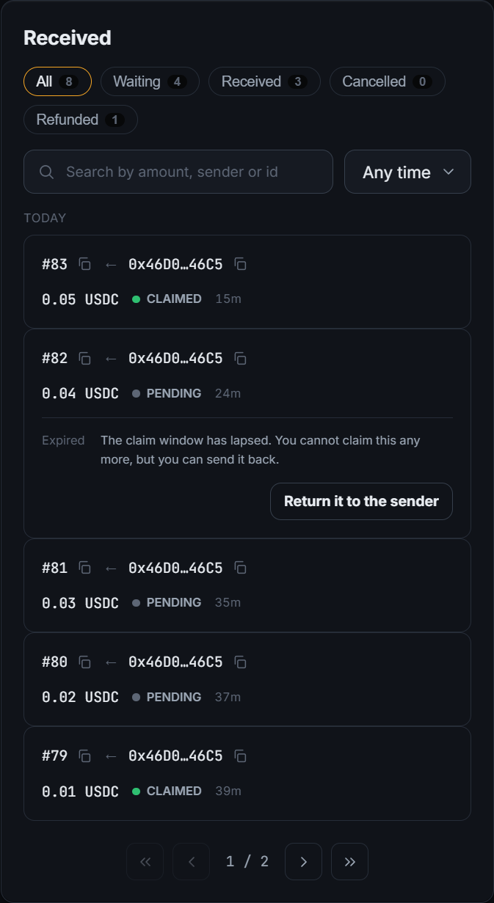</td>
</tr>
<tr>
<td>The recipient never had to hold gas: a zero-balance wallet claimed this through the relayer.</td>
<td>Everything ever sent to this wallet, read from chain rather than from this browser. Search, a date range, days grouped as days, and every id, address and transaction copyable.</td>
</tr>
</table>

The recipient does not have to be watching. An arriving transfer announces itself
within a few seconds wherever the user is standing, and the badge on the Receive
side counts what is actually claimable: a transfer whose window has closed stops
being counted, because pressing claim on it would only spend gas to revert.

Settlement is immediate, because Arc has sub-second deterministic finality. There is no pending limbo for the recipient to sit in.

### Case B: the firewall refuses

The Send form does the whole attack in one click. It reads who this wallet has actually paid, crafts a **real** lookalike of one of them (same first and last four hex characters, random middle), and drops it into the recipient field, so the firewall you are about to trust is the one that judges it. Nothing is sent; the verdict appears where every verdict appears.

<p>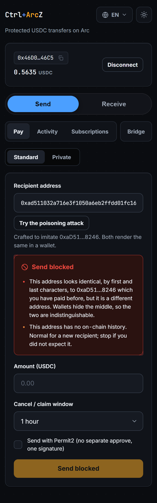</p>

Both addresses render as `0x64Ea…Fe3F` in any wallet. The firewall blocks the second one, and the send never happens.

### Case C: the sender changes their mind

`cancel` is available to the sender at any point before a claim lands, inside or outside the window, and even on a transfer that has been frozen by wrong guesses. Unclaimed money belongs to the sender, so there is no deadline on getting it back.

<p>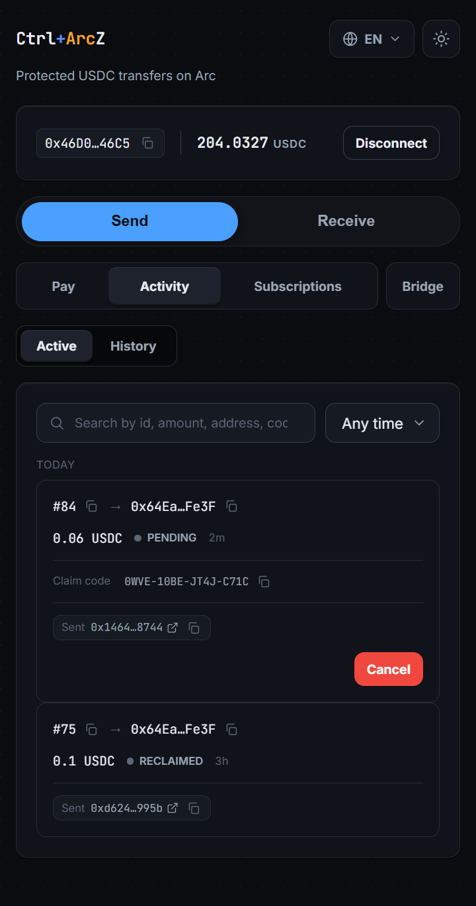</p>

### Case D: the recipient never claims

When the recall window lapses, `reclaimExpired` returns the funds to the sender. It is callable by **anyone**, and the money can only ever go back to the sender. That is what makes the refund automatic: a recipient who disappears cannot strand the funds, and the sender does not have to be online at the right moment.

The recipient gets that button too. A payment you never wanted, arriving from someone you do not know, is the one case where the receiving side used to have nothing to do but wait, and the contract already allowed the fix: `reclaimExpired` pays the sender and nobody else, so handing anyone the button costs nothing. The row says the window has lapsed and offers to send it back. The keeper (`apps/keeper`) presses the same button on a schedule for transfers nobody is looking at.

### Case E: the recipient holds no USDC at all

On Arc, gas is USDC, so a brand new recipient with an empty wallet cannot normally pay to claim. Because `claim` is permissionless and always pays the recorded recipient, a relayer can submit it and cover the gas. The recipient receives the full amount without ever sending a transaction. This is verified on-chain: a fresh, zero-balance, nonce-zero address received the whole transfer and its nonce stayed at zero.

The recipient just presses **Claim without gas**. The claim is signed server-side so no relayer or Circle key reaches the browser, and with Circle Gas Station configured the gas is sponsored rather than paid by anyone in this project: measured on Arc testnet, the claim ran through EntryPoint v0.7 from a Circle Smart Account holding no USDC, the paymaster paid 0.0062 USDC of gas, and the relayer's own balance moved by zero. Without Gas Station credentials the same route falls back to a relayer signing and paying out of its own balance, so the recipient's experience is identical either way.

## Moving USDC in: CCTP or Gateway

A protected transfer needs USDC on Arc. Both of Circle's cross-chain routes are wired in, and the choice is a single tab.

<table>
<tr>
<td width="50%">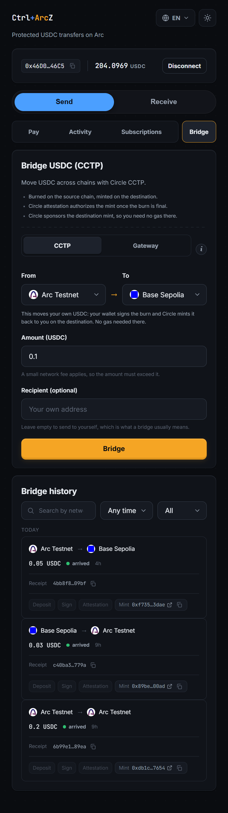</td>
<td width="50%">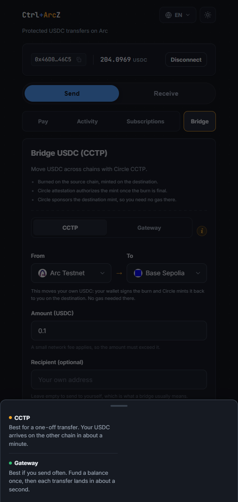</td>
</tr>
<tr>
<td>Pick the route, the source and destination chain, and the amount.</td>
<td>The app says plainly which route fits which habit.</td>
</tr>
</table>

|                   | CCTP                                        | Gateway                                                     |
| ----------------- | ------------------------------------------- | ----------------------------------------------------------- |
| Model             | Burn on the source, mint on the destination | Deposit once into a unified balance, then spend from it     |
| First transfer    | About a minute                              | The deposit, then the spend                                 |
| Repeat transfers  | About a minute, every time                  | Seconds, no deposit                                         |
| Best for          | A one-off move                              | Sending often                                               |
| Chains on testnet | 20                                          | 11                                                          |
| Destination gas   | None needed, Circle forwards the mint       | None needed, Circle forwards the mint                       |

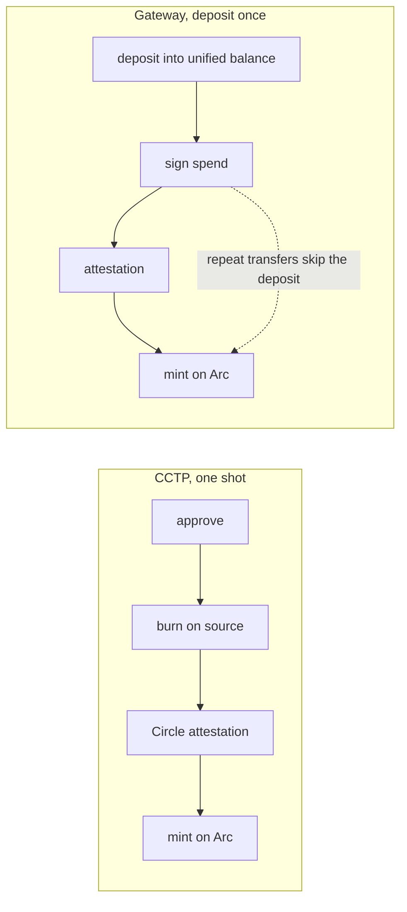
```mermaid
flowchart LR
    subgraph CCTP["CCTP, one shot"]
        A1[approve] --> A2[burn on source] --> A3[Circle attestation] --> A4[mint on Arc]
    end
    subgraph GW["Gateway, deposit once"]
        B1[deposit into unified balance] --> B2[sign spend] --> B3[attestation] --> B4[mint on Arc]
        B2 -. repeat transfers skip the deposit .-> B4
    end
```

The Gateway deposit is the whole cost of using it, and it is wildly uneven: a deposit on Arc counts in about a second, one from Base takes up to nineteen minutes by Circle's own confirmation counts. The app says which it is before you commit, and offers the cheaper source when your balance is already on one. After that, spending is the same few seconds from any chain, including one your wallet has never had a transaction on.

Gateway supports fewer chains than CCTP, so the pickers narrow themselves when you switch to it rather than offering a route that cannot run.

<table>
<tr>
<td width="50%">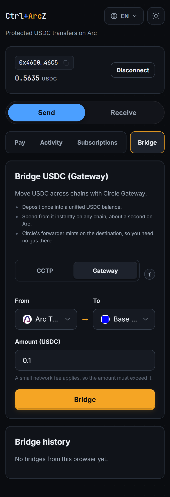</td>
<td width="50%">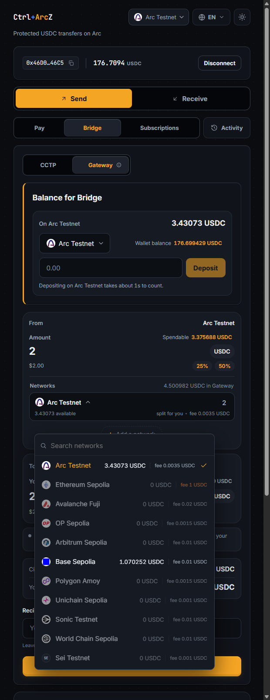</td>
</tr>
<tr>
<td>Gateway selected. The step list changes with the route.</td>
<td>Only the chains Gateway actually supports, searchable, with real network logos.</td>
</tr>
</table>

Both routes are signed by **the user's own wallet**. Nothing in this project ever holds a key that could move somebody's USDC: the burn, the Gateway deposit and the Gateway spend are all transactions or EIP-712 signatures the wallet produces, and Circle's own attestation service does the rest. There is no operator balance to fund and nothing to trust with custody, which is the only version of a bridge worth shipping inside a product about not losing money to the wrong address.

That costs a little more work than calling Circle's Node-first kits from a server, and the SDK carries it: `packages/sdk/src/bridge` speaks to the CCTP and Gateway contracts and REST APIs directly, queues transactions per signer so two flows on one wallet cannot race a nonce, checks that the source chain can actually pay for its own burn, and can pick a stalled transfer back up from its burn hash after a reload.

**A transfer that does not arrive is not money lost, and the row says so.** A Gateway spend does not burn on the source chain when the intent is accepted: Circle debits its own ledger and settles later, so a mint that fails means the burn never ran and what left the balance was a hold. Circle lets it go, measured twice at under ten minutes with the fee included. Calling that "failed" would tell someone their money is gone while it is on its way back, so the row reads `returning` and then `returned`. Circle's status stays `failed` for good and can never report the release, so the app watches the balance instead, against the figure it wrote down before the spend.

## Why Arc

The lock-then-claim mechanic needs two transactions. That is exactly what has kept it off other chains, and it is what Arc removes.

- **Gas is USDC, cheap and predictable.** The second transaction is economical, and there is no separate gas token to acquire before you can move your money.
- **Sub-second deterministic finality.** The transfer settles the moment the code is entered. The recipient never watches a spinner.
- **The primitives are already there.** Permit2 removes the per-send approve. CCTP and Gateway bring the USDC in. Circle publishes a refund primitive of its own. The pieces exist; what is missing is a product that puts refusal, locking, claiming and refunding into one flow.

## Smart contracts

| Contract              | Address                                                                                                                        | Role                                                      |
| --------------------- | ------------------------------------------------------------------------------------------------------------------------------ | --------------------------------------------------------- |
| **CtrlArcZ**          | [`0x8dAb7148cdc31DAcad6d7e12161AA3DEDb572Dca`](https://testnet.arcscan.app/address/0x8dAb7148cdc31DAcad6d7e12161AA3DEDb572Dca) | Config registry, protected transfers, verified recipients |
| **CodeClaimVerifier** | [`0x2C0f268DE2Aa8BB2ab27F2Ea5Ae8a0f9a0E068c4`](https://testnet.arcscan.app/address/0x2C0f268DE2Aa8BB2ab27F2Ea5Ae8a0f9a0E068c4) | Checks `keccak256(salt, code)` for `ClaimMode.CODE`       |
| USDC (Arc predeploy)  | `0x3600000000000000000000000000000000000000`                                                                                   | The asset, and the gas                                    |

Deploy block `51326557`. Nothing is deployed to mainnet, and nothing will be.

| Function                                    | Caller      | Purpose                                                          |
| ------------------------------------------- | ----------- | ---------------------------------------------------------------- |
| `createConfig(window, mode, feeBps, feeTo)` | Integrator  | Register a behaviour, get a deterministic `configId`             |
| `sendProtected(configId, to, amount, hash)` | Sender      | Lock USDC against a claim commitment                             |
| `sendProtectedWithPermit(..., signature)`   | Sender      | The same, pulled through Permit2, so no separate approve tx      |
| `claim(id, code, salt)`                     | Anyone      | Release to the recorded recipient. Returns false on a wrong code |
| `cancel(id)`                                | Sender only | Take the money back, any time before a claim lands               |
| `reclaimExpired(id)`                        | Anyone      | Refund an expired transfer. Only ever to the sender              |
| `isVerifiedRecipient(sender, recipient)`    | Anyone      | Layer 3, read by the firewall                                    |

The contract is **ownerless**: no owner, no pause, no proxy, no upgrade path, no admin function that can touch a locked transfer. A protected-transfer contract that an admin can drain protects nobody. There are 61 Foundry tests on this contract alone and 99 across the suite, including fuzz tests for value conservation, the fee split, cancel, and the property that a valid proof only ever pays the recorded recipient. Branch coverage is 100 percent.

## Security

The full audit lives in [`SECURITY.md`](./SECURITY.md). The short version:

- **No key is hardcoded anywhere.** Every signing key is read from the environment, and both Vite configs **refuse a production build** that would inline one, unless the operator explicitly acknowledges it.
- **Nothing signs for the user but the user.** The protected transfer, the CCTP burn and both halves of a Gateway move are the wallet's own signatures. The one server-signed path is the gasless claim, and it settles a transfer that can only ever pay the recipient recorded on chain; the browser posts the transfer id, code and salt and never holds a relayer or Circle key.
- **The firewall fails closed** rather than degrading to "looks fine" when a data source is down.
- **Every path that moves money runs the firewall**, from one module, and none of them arms its button before the verdict is in. Four screens deciding this for themselves is how one of them ends up with a weaker door than the others.
- **Claim receipts are bound to the contract address and the exact transfer id**, so an unrelated or planted event in a batched receipt cannot decide a victim transfer's outcome.

## Tech stack

| Layer       | Choice                                                                |
| ----------- | --------------------------------------------------------------------- |
| Contract    | Solidity 0.8.24, Foundry, OpenZeppelin (SafeERC20, ReentrancyGuard)   |
| SDK         | TypeScript, viem, tsup (ESM, CJS and types), vitest                   |
| Risk data   | ArcScan (Blockscout REST), behind an `IDataProvider` seam             |
| Cross-chain | Circle CCTP and Circle Gateway, both signed by the user's own wallet  |
| Gasless     | Permissionless `claim`, sponsored by Circle Gas Station, relayer fallback |
| Approvals   | Permit2, for single-signature sends                                   |
| Apps        | React, Vite, a shared design system in `@ctrl-arcz/demo-kit`          |

Every list of past things in the app is one component. Sent transfers, the plain
history, received transfers, bridges and subscriptions had each grown their own
search box, their own pager and their own idea of what a row looks like, and they
drifted the way copies do: only some values were copyable, only some rows carried
the transaction, and none of them could be narrowed by date. `HistoryList` and
`HistoryRow` in `@ctrl-arcz/demo-kit/ui` are the one vocabulary all five now speak,
so adding a date filter was one change in one place rather than five. The rule that
shaped the row: anything that is data rather than prose carries its own copy button.

## Repository layout

| Path                 | What                                                                    |
| -------------------- | ----------------------------------------------------------------------- |
| `packages/contracts` | `CtrlArcZ.sol`, `CodeClaimVerifier`, `IClaimVerifier`, Foundry tests    |
| `packages/sdk`       | `@ctrl-arcz/sdk`, the thing an integrator actually installs             |
| `packages/demo-kit`  | Shared wallet session, the design system, and the server-side helpers   |
| `apps/sender`        | The web app, port 5173. Sending and receiving are two modes of it       |
| `apps/api`           | The backend: co-signer, relayer, gasless claim, discovery, investigator |
| `apps/keeper`        | The keeper agent: returns expired transfers, paid from a bounded box    |
| `examples`           | A standalone Node quickstart, no framework                              |

The Android client is a separate native Kotlin/Compose app rather than a package
here. It is not a port of the web app: it holds its own risk engine, stealth
cryptography and CCTP/Gateway clients, and calls the same `apps/api` and the same
deployed contracts. What keeps the two implementations honest is
`packages/sdk/parity-vectors.json`, generated by `scripts/gen-parity-vectors.ts`
and asserted by both test suites, so a Kotlin port that drifts from the TypeScript
one fails a test rather than a payment.

Every address, RPC and chain constant lives in exactly one file, `packages/sdk/src/chains/arcTestnet.ts`. The Foundry deploy script reads a JSON file generated from it, so no address is written down twice.

## Getting started

```bash
git clone --recurse-submodules https://github.com/Farukest/Ctrl-ArcZ.git
cd Ctrl-ArcZ
pnpm install

cp .env.example .env      # fill in throwaway testnet wallets
```

USDC is both gas and the asset on Arc, so fund the wallets with Arc Testnet USDC from [faucet.circle.com](https://faucet.circle.com). Foundry is required for the contract: <https://getfoundry.sh>

| Command               | What it does                                        |
| --------------------- | --------------------------------------------------- |
| `pnpm build`          | Build every package                                 |
| `pnpm test`           | Foundry plus vitest                                 |
| `pnpm contracts:test` | Contract tests only                                 |
| `pnpm lint`           | ESLint across the workspace                         |
| `pnpm typecheck`      | `tsc --noEmit` in every package                     |
| `pnpm deploy:testnet` | Deploy `CtrlArcZ` to Arc Testnet                    |
| `pnpm dev:api`        | The backend on http://localhost:8787                |
| `pnpm dev:sender`     | The web app on http://localhost:5173                |

Run both: the web app calls the backend for the gasless claim, the co-signer, the
stealth relay and the investigator, and without it those answer 404 from a page
that otherwise looks perfectly healthy. The backend refuses any browser origin not
listed in its `CORS_ORIGINS`, so a local run needs `http://localhost:5173` in
there — see [`apps/api/.env.example`](./apps/api/.env.example).

Using the SDK is three calls, and the firewall is one of them whether you ask for it or not:

```ts
import {
  defineConfig,
  registerConfig,
  generateClaimCode,
  approveUsdc,
  sendProtected,
  RiskBlockedError,
} from '@ctrl-arcz/sdk';

const config = defineConfig({ recallWindow: 3600 });
const { configId } = await registerConfig(clients, config);
const secret = generateClaimCode(); // secret, code, salt, claimHash

await approveUsdc(clients, amount);

try {
  // Layer 1 runs inside this call. A lookalike or a zero-value baiter throws
  // before a single unit of USDC moves. There is no separate call to forget.
  const { transferId } = await sendProtected(
    clients,
    { configId, to: recipient, amount, claimHash: secret.claimHash },
    { config },
  );
} catch (e) {
  if (e instanceof RiskBlockedError) showRiskCard(e.report);
  else throw e;
}
```

The recipient claims with `claim(clients, transferId, code, salt)`, where both come from `fromSecret(typed)`. The sender can `cancel(clients, transferId)` at any time before that. Full signatures, and how to reuse a report your own UI already fetched, are in [`packages/sdk/README.md`](./packages/sdk/README.md).

The demos run without MetaMask if you drop a `.env.local` into each app; the wallet is then a local test signer that still broadcasts real transactions to Arc Testnet. See [`.env.example`](./.env.example).

## Subscriptions and agent wallets

Sending once is easy. The hard part is letting something spend *repeatedly* without handing it your wallet. A subscription, an allowance, an AI agent that pays its own bills: each needs a budget that renews, not a blank cheque.

Ctrl+ArcZ solves this with a **disposable spend box**. You do not pay the merchant directly. You create a tiny on-chain account, fund it with a budget, and lock a policy into it: *this merchant only, this much per pull, this often, until this date.* An off-chain co-signer ("The Machine") firewall-checks every pull and refuses to sign anything outside the policy. The box's own code enforces the same limits, so even a leaked co-signer key or a misbehaving merchant can never take more than the budget, or send it anywhere else.

You stay invisible (the merchant sees the box, never your wallet), you stay bounded (the worst case is the budget you funded), and you can cancel any time (sweep the box, funds come home, the pulls stop).

The co-signer is a gatekeeper, not a custodian. Bringing the money home (`sweepToVault`, or `sweepExpired` once the date passes) needs only your own key, never the co-signer's, so if The Machine goes offline or turns hostile it can stall a pull but can never hold your funds. Its role is liveness, not custody: worst case you sweep and the subscription simply ends. There is no timezone or clock trick to exploit either, since the on-chain caps (per-pull and total) bound the loss independently of time, and the contract reads a plain UTC block timestamp with intervals measured in days.

**Create a subscription.** Name it, point it at a merchant, then say the two things anyone actually has in mind: how much each charge is, and how many of them. The budget is shown rather than asked, because it is an answer, and it is shown beside what Circle charges to move it into the box and what the two come to together. Authorising a subscription is a payment, and it was the last payment screen in the app that did not say what would leave the wallet.

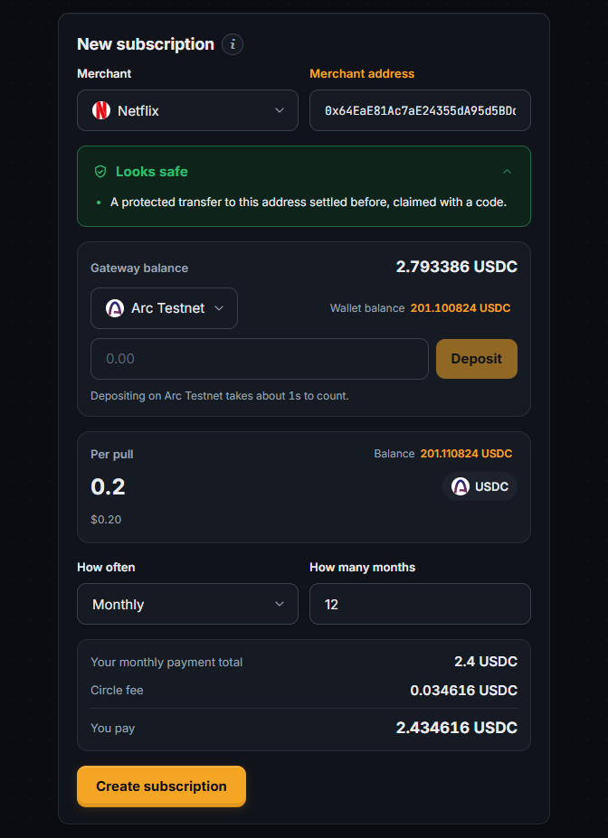

The form used to ask for a per-pull cap, an interval, a total budget and an expiry as four independent fields, and left the arithmetic between them to the person filling it in. Nobody thinks "0.02 every minute against a 0.1 budget"; they think "one a month, twelve times". Deriving the budget removed a whole class of quiet mistake with it: funding 0.1 against 0.03 charges gave three pulls and stranded 0.01 with nothing on screen saying so, and the "budget must be at least one charge" error is now unreachable rather than merely unlikely. The contract sees the same numbers either way.

**Manage them all in one place.** Every box you created, read straight from chain, with live status, search, status filters, sorting and pagination. It is the same list component as every other history in the app, with one difference that matters: a subscription's date is when it *ends*, so the date filter narrows forwards ("ends within 7 days") instead of backwards:

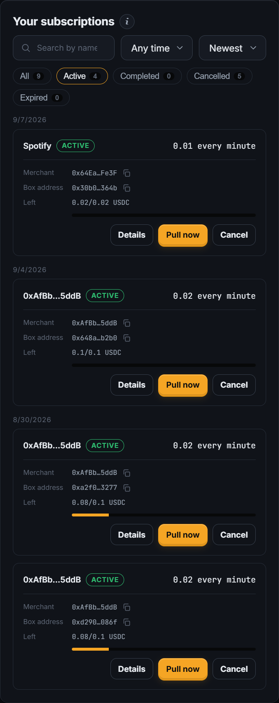

**Full detail per box.** How much has been pulled, what is left, when the next pull is allowed, and the box address on ArcScan, all live:

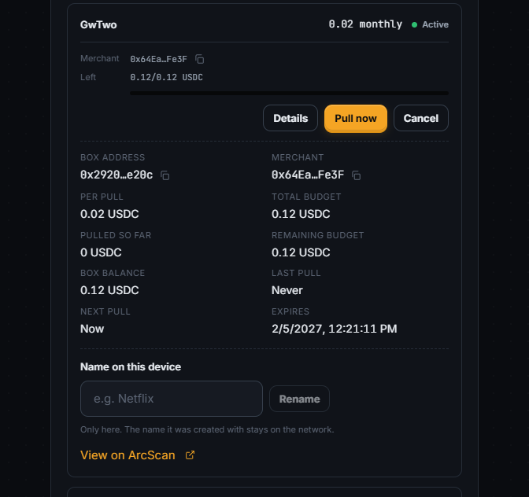

**The name travels with the box, not with the browser.** It is packed into the box's stealth announcement, which the app already fetches in bulk, so it costs no extra request and reads the same on every device. It used to live in `localStorage`, which meant a subscription called "Netflix" on one machine was an unnamed address on every other one, and it was the only thing about a subscription not read live from the chain. A browser can still rename one locally, instantly and for free, and clearing that override falls back to the announced name rather than blanking it.

Every screenshot above is a real subscription on Arc Testnet. The boxes were deployed and funded on-chain, and cancelling really sweeps the box home. The same box in `MODE_PULL` powers the **agent wallet** case: hand an autonomous agent one tightly-scoped box and it can transact on its own, but never past the policy.

**Discovery is served, not surrendered.** The announcer is a single global registry and carries no owner tag, because not having one is the point. So finding your own boxes means testing every announcement ever made against your viewing key, and doing that from the browser meant reading 2.19 million blocks in 219 chunked requests on every visit, growing by about 168,000 blocks a day. That cost is the shape of the query, not the size of the data: 219 requests to find nineteen records, because `eth_getLogs` is asked by block range and Arc caps that range at 10,000.

Two sources answer it in one request instead. `GET /api/announcements` serves the list from an index that backfilled once and follows the chain, and reports the head it is complete to. If that is unreachable, the chain's own explorer has indexed the same events and pages by result rather than by block, so it has no range to chunk. Neither is believed without proof: the index must say `complete`, and the explorer must report a finished backfill and a head within 250 blocks of the chain's. When both decline, the browser reads the chain itself. Slow is an acceptable answer on this screen; short is not, because a missing announcement is a funded box that never appears.

Nothing in either path names a wallet. The announcement list is undirected by design, and the factory list is filtered for your own `ownerHash` after it arrives rather than as a topic in the request, so neither the server nor the explorer learns who is asking.

The endpoint takes no address and returns identical bytes to every caller, verified by hashing two responses. It has to: recognising which announcements are yours needs the viewing key, the key comes from a wallet signature and never leaves the browser, and the matching happens there. An endpoint that accepted a viewing key would be shorter to write and would hand over the exact thing the stealth addresses exist to protect. When the index is unreachable or still backfilling it says so, and the browser reads the chain itself rather than trust a partial list, because a missing announcement is a missing subscription and on that screen it looks identical to having none.

**A box is owned by a one-time address, and the payer stays off its transactions.** The owner and vault of each box is a fresh ERC-5564 stealth address, announced so that only the payer's viewing key can rediscover it; that is how the list above is built, without an identity or a wallet-derived tag on chain. The two transactions that would otherwise name the payer are relayed: the deploy, and the announcement (`StealthAnnouncer` indexes `msg.sender`, so announcing from your own wallet would publish "this wallet made a stealth box"). So is the small gas top-up a stealth address needs before it can sweep itself, since paying that from your own wallet would write the exact link the stealth address exists to avoid. None of the relayed calls can move a user's funds.

**The budget arrives from Circle, not from your wallet.** Funding used to be an ordinary transfer from the payer into the box, and that single line undid everything above it: both ends of an ERC-20 transfer are indexed, so anyone could take a wallet's outgoing transfers, intersect them with the announcer's metadata, and recover its boxes without a viewing key at all. Measured on a real wallet: eight boxes out of eight, no false positives. The box is now funded by a Circle Gateway mint, so what Arc records is Circle's minter paying the box, and the payer is not in it. There is deliberately no fallback to the old transfer, because a second route is a second way to write that line, and it is the one taken when something else has already gone wrong.

[`docs/privacy.md`](./docs/privacy.md) traces every USDC movement around one real box and states exactly what is and is not hidden.

## The keeper: an agent with a wallet, bounded by the chain

`reclaimExpired` is permissionless and always pays the original sender, so the
refund needs no trusted party, but permissionless is not automatic. Until
something calls it, an unclaimed transfer just sits in the contract. The keeper
(`apps/keeper`) is that something, and it is where the agent-wallet claim stops
being a diagram.

It is not handed a funded wallet and trusted to behave. It is paid the way this
product pays any recurring payee: from a `SpendPolicyAccount` in PULL mode whose
policy is on chain: target locked to the keeper, a per-pull ceiling, a minimum
interval, a total budget, an expiry. Its entire blast radius is a number the
operator chose and can read back from chain, and on Arc that number is in the same
asset it spends, because gas is USDC.

Verified on Arc Testnet with the keeper's real key: it reclaimed transfer #50 and
the `TransferReclaimed` event records `caller` as the keeper and `sender` as the
original sender, while the recorded recipient received nothing. Then four attacks
against its own budget (asking the co-signer for ten times the per-pull cap,
forging the co-signer signature, sweeping the box to itself, and sweeping it to
the correct vault) were each refused, and the operator revoked the remainder in
one `sweepToVault`. Details and the full trace: [`apps/keeper/README.md`](./apps/keeper/README.md).

## The investigator: the judgement a rule cannot make

The firewall answers one question at a time, the same way every time. That is what
makes it worth trusting, and it is also its ceiling: it says *"this address has no
on-chain history"* about a colleague's fresh wallet and about a contract that
would swallow the payment, because from any single rule those are identical. A
real dossier from Arc Testnet shows the gap plainly. The rules rate the CtrlArcZ
contract itself `safe / KNOWN_COUNTERPARTY`, because the sender has interacted
with it, while `isContract: true` means a direct USDC transfer there is gone.

`POST /api/investigate` gathers the signals a rule cannot combine and reports what
they add up to. **It can only ever tighten.** Every answer is clamped to the rule
engine's verdict before it leaves the server, so a wrong or prompt-injected reply
can refuse a good payment but cannot approve a bad one or un-block a lookalike:
the only operation available to it is `max`. And it is optional: with no API key,
on a timeout, or on a malformed reply, the route returns the unchanged rule
verdict and the app behaves exactly as it does without the feature.

## Known limits

- The contract has not been audited. Testnet only.
- The firewall depends on a single indexer (ArcScan). If it cannot be reached, the report degrades to a warning, or to a block when a lookalike cannot be ruled out. It never degrades to safe.
- The announcement index lives in one server process's memory. It rebuilds on restart, and until it finishes the browser falls back to reading the chain. A deployment with more than one instance would want it in shared storage.
- The keeper spends its own gas to return other people's money, so it never profits. It is a service the operator runs, not an incentivised keeper network.
