# Ctrl+ArcZ

**Yanlış gönderimi reddet. Doğrusunu kilitle. Kimse almazsa parayı geri ver.**

Arc üzerinde korumalı USDC transferi: bir ödemeyi imzalanmadan önce tarayan, alıcı kendisine ait olduğunu kanıtlayana kadar kontratta tutan ve hiç talep edilmezse gönderene iade eden bir SDK ve tek bir kontrat.

[English version](./README.md)

## İçindekiler

- [Tek bakışta](#tek-bakışta)
- [Problem](#problem)
- [Karşılaştırma](#karşılaştırma)
- [Sistem mimarisi](#sistem-mimarisi)
- [Üç katman](#üç-katman)
- [Senaryolara göre akışlar](#senaryolara-göre-akışlar)
- [USDC'yi Arc'a getirmek: CCTP veya Gateway](#usdcyi-arca-getirmek-cctp-veya-gateway)
- [Neden Arc](#neden-arc)
- [Akıllı kontratlar](#akıllı-kontratlar)
- [Güvenlik](#güvenlik)
- [Teknoloji](#teknoloji)
- [Depo yapısı](#depo-yapısı)
- [Başlangıç](#başlangıç)
- [Bilinen sınırlar](#bilinen-sınırlar)

## Tek bakışta

|             |                                                                                                 |
| ----------- | ----------------------------------------------------------------------------------------------- |
| **Ağ**      | Arc Testnet, chain id `5042002`                                                                 |
| **Varlık**  | USDC. Arc'ta hem gas token'ı hem gönderdiğiniz şey                                              |
| **Koruma**  | Gönderim öncesi risk firewall'u, kodla claim, gönderen iptali, süre dolunca otomatik iade       |
| **Custody** | Yok. Para ya kullanıcıda ya kontratta. Owner yok, pause yok, upgrade yolu yok                   |
| **Ürün**    | Herhangi bir cüzdanın, borsanın veya ödeme uygulamasının gömdüğü bir SDK. Yeni bir cüzdan değil |
| **Testler** | 61 Foundry testi (dal kapsamı yüzde 100), 53 SDK birim testi, canlı testnet koşuları            |

## Problem

Address poisoning, stablecoin kaybetmenin en hızlı büyüyen yolu ve her cüzdanın paylaştığı tek bir ayrıntı yüzünden işliyor: adresler kısaltılarak gösteriliyor, `0x64Ea…Fe3F` gibi. Saldırgan, sizin zaten ödeme yaptığınız bir adresle ilk ve son karakterleri aynı olan bir adres üretiyor, oradan size 0 değerli bir transfer atıp kendini işlem geçmişinize yerleştiriyor ve bekliyor. Aynı kişiye bir daha ödeme yaparken adresi kendi geçmişinizden kopyalıyorsunuz ve ikisi ayırt edilemiyor.

Belirleyici özellik şu: **kurban yanlış adrese bilerek gönderiyor.** Beklenmedik bir şeyi imzalaması için kandırılmıyor. Adresin doğru olduğuna inanıyor ve bu inancın ardından gelen her şey normal işliyor.

Büyük transferlerden önce herkesin yaptığı ritüelin, yani önce bir dolar gönderip onay beklemenin, bu yüzden faydası yok. Test transferi de zehirlenmiş adrese gidiyor ve sorunsuz onaylanıyor. İki kez ödediniz, beklediniz ve hiçbir şey kanıtlamadınız.

Tek başına escrow'un da bu yüzden faydası yok. Yanlış alıcı için parayı kilitlemek, parayı saldırgan için kilitlemektir.

Bir yerde birinin gönderimi reddetmesi gerekiyor.

## Karşılaştırma

|                              | Gönderimi durdurur | Sonradan para kurtarılabilir  | Arbiter gerekir | Custody alır | Düz P2P'de çalışır |
| ---------------------------- | ------------------ | ----------------------------- | --------------- | ------------ | ------------------ |
| Cüzdan adres defteri uyarısı | Hayır              | Hayır                         | Hayır           | Hayır        | Evet               |
| Poisoning tespit servisi     | Sadece uyarır      | Hayır                         | Hayır           | Hayır        | Evet               |
| Ticari escrow                | Hayır              | Evet, anlaşmazlık yoluyla     | Evet            | Evet         | Hayır              |
| Circle Refund Protocol       | Hayır              | Evet, aracı yoluyla           | Evet            | Evet         | Hayır              |
| **Ctrl+ArcZ**                | **Evet**           | **Evet, gönderen tarafından** | **Hayır**       | **Hayır**    | **Evet**           |

Circle'ın Refund Protocol'ü bilinçli olarak farklı bir problemi çözüyor. Bir **arbiter** etrafında kurulu ticari escrow: aracı, lockup penceresini belirliyor ve alıcı satıcı anlaşmazlıklarında iadeyi yetkilendiriyor. Ctrl+ArcZ ise P2P yanlış adres güvenliği: iptal hakkı gönderende, süre dolumu iadesi otomatik ve parayı üçüncü bir taraf hareket ettiremiyor. Araya bir arbiter koymak, korumalı transfer kontratını güvenilir kılan tek özelliği bozardı.

Arc'ta incelediğimiz, fon kilitleyen projelerin tamamı ticaret bağlamında: fatura linki, freelance teslimi, marketplace mutabakatı. Transfer güvenliği farklı bir şekil ve bu SDK'nın şekli o.

## Sistem mimarisi

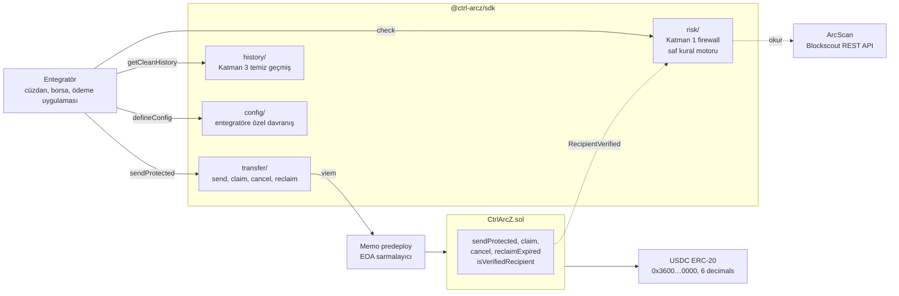

Tek deploy, çok kiracı. Entegratör bir kez `createConfig` çağırıp kendi davranışını kodlayan bir `configId` alır: recall penceresi, claim yöntemi, opsiyonel fee, korumaya değer minimum tutar. Bir borsanın çekim ekranı ile bir P2P cüzdanı çok farklı şeyler isteyebilir ve yine de aynı kontratı, aynı SDK'yı kullanır.

## Üç katman

### Katman 1: firewall, hiçbir şey imzalanmadan önce

`check(sender, target)` derecelendirilmiş bir karar döner. Saf bir kural motorudur: aynı girdi her zaman aynı kararı üretir, kararın içinde ağ çağrısı yoktur.

| Kural                | Karar     | Neden                                                                                             |
| -------------------- | --------- | ------------------------------------------------------------------------------------------------- |
| `LOOKALIKE_ADDRESS`  | **block** | Hedef, bu gönderenin gerçekten ödeme yaptığı bir adresle ilk ve son dört hex karakteri paylaşıyor |
| `ZERO_VALUE_BAIT`    | **block** | Hedef, bu gönderene 0 değerli transfer atmış. Birine sıfır token göndermenin başka amacı yok      |
| `FRESH_ADDRESS`      | uyarı     | İlk kez 24 saatten kısa süre önce görüldü. Poisoning adresleri saldırı için taze üretilir         |
| `NEW_ADDRESS`        | uyarı     | Hiç zincir geçmişi yok                                                                            |
| `VERIFIED_RECIPIENT` | güvenli   | Bu adrese daha önce korumalı bir transfer kodla claim edilerek ulaştı                             |
| `KNOWN_COUNTERPARTY` | güvenli   | Bu adrese daha önce ödeme yapıldı                                                                 |

Kural listesinden daha önemli iki özellik var.

**Olumlu bir sinyal bloğu asla ezmez.** Geçen hafta ödeme yaptığınız bir adres, onun ikizini güvenli yapmaz. Saldırının tamamı zaten bu.

**Firewall kapalı düşer.** Gönderenin ödeme geçmişi çekilemezse benzer adres kuralı çalışamamış demektir, dolayısıyla bir ikiz elenemez. Doğrulanmamış bir hedef, kullanıcının tıklayıp geçeceği bir uyarıya düşürülmek yerine bloklanır. Veri kaynağı çöktüğünde trafiği geçiren bir firewall, hiç firewall olmamasından kötüdür; rapor asla sessizce güvenli işaretlenmez.

**Çağırmayı hatırlamanız gerekmiyor.** `sendProtected` taramayı kendisi çalıştırır ve para kımıldamadan `RiskBlockedError` fırlatır; yani SDK'yı kurmak korumalı olmak demektir. Entegratörün unutabileceği ayrı bir çağrı, savunma değildir.

<table>
<tr>
<td width="50%">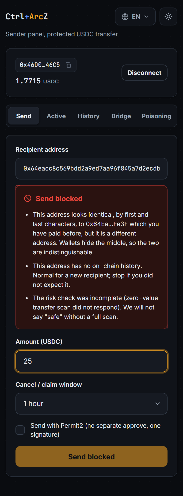</td>
<td width="50%">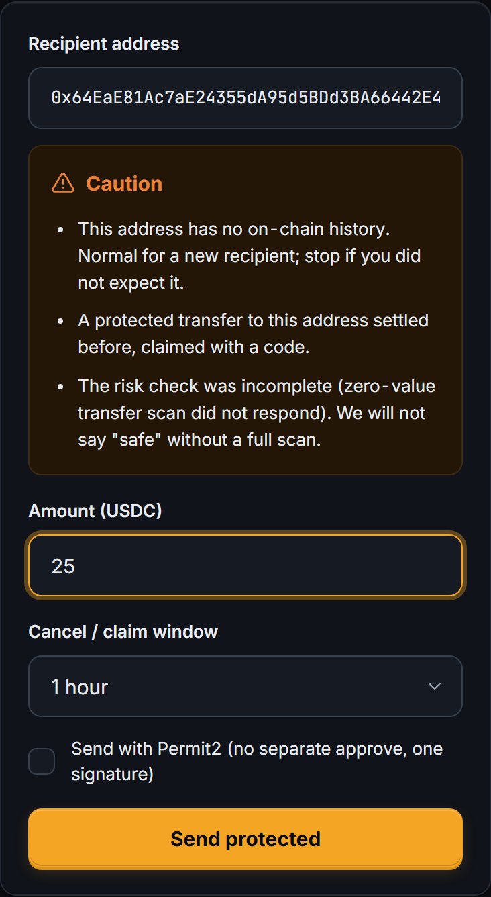</td>
</tr>
<tr>
<td>Bu cüzdanın ödeme yaptığı bir adresin ikizi. Gönder butonu kurulmuyor.</td>
<td>Kararlar derecelidir; eksik tarama güvenliye yuvarlanmaz, açıkça söylenir.</td>
</tr>
</table>

### Katman 2: korumalı transfer

Para kontratta kilitlenir ve yalnız alıcının elindeki bir kanıt karşılığında serbest bırakılır.

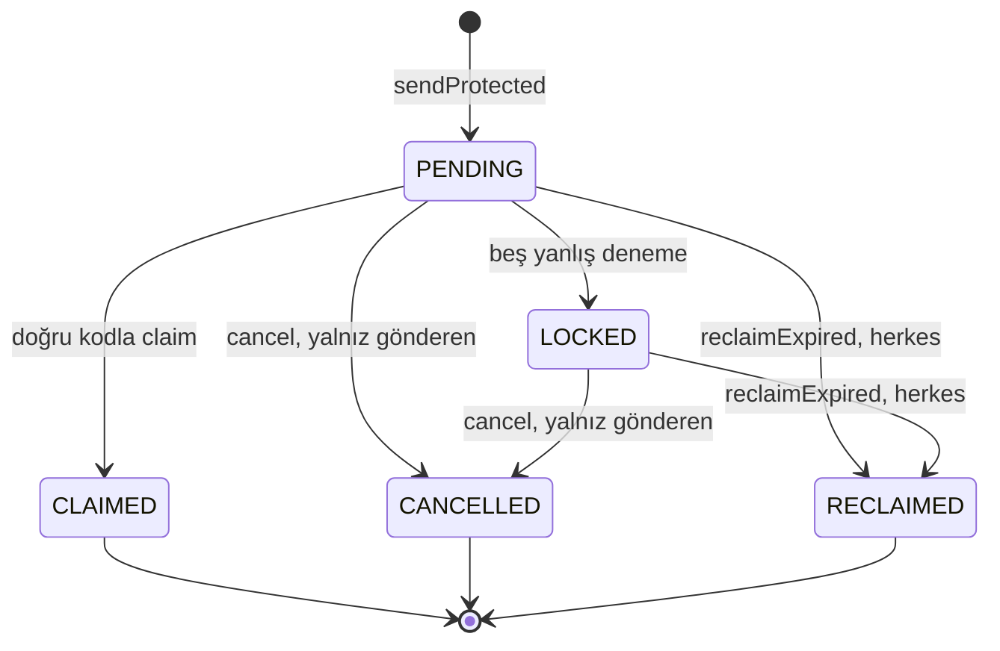

Kanıt bilinçli olarak ikiye bölünür. SDK, gönderenin alıcıya sözlü olarak ilettiği **6 haneli bir kod** ve claim linkinde giden **256 bitlik bir salt** üretir. Zincir yalnızca `keccak256(salt, code)` görür. Tek başına 6 hane 20 bit entropidir ve offline kırılması önemsizdir; entropiyi salt taşır, kodu ise insan taşır.

Kontratta bilinmesi gereken iki karar var:

**Yanlış kod revert etmez, `false` döner.** Deneme sınırlayıcısı revert eden bir çağrının üzerine kurulamaz, çünkü revert tam da başarısız denemeyi kaydeden sayacı geri alır ve 20 bitlik kod zincir üstünde gas parasına kırılabilir hale gelir. Başarısız denemenin kaydedilmesi şart. `claim` bir boolean döner ve denemeyi zincire yazar; beş yanlış deneme transferi dondurur, SDK makbuzu okuyup `WrongClaimCodeError` fırlatır ve madenilen bir işlemi başarılı claim saymaz.

**Claim'i herkes gönderebilir ve para her zaman gönderim anında kaydedilen alıcıya gider.** Bu, claim'i front-run'a karşı güvenli kılar (açığa çıkmış bir kanıtı tekrarlayan biri yalnızca transferi asıl alıcısı için sonuçlandırır) ve gasless yolunu mümkün kılan da budur.

### Katman 3: güvenilecek bir geçmiş

Poisoning yalnızca sahte adres kurbanın geçmişinde durduğu, bir dokunuşla kopyalanabildiği için işliyor. `getCleanHistory` bu yüzeyi iki kuralla yok eder: 0 değerli transferleri düşür ve yalnız bilinen token'ları göster (kampanyalar genelde satırları gerçek bir USDC satırı gibi okunsun diye kendi taklit token'larını basar). Hiçbir şey silinmez; filtrelenen satırlar ayrıca döner, böylece arayüz "spam'i göster" seçeneği sunabilir ve SDK neyi gizlediği konusunda dürüst kalır.

Katman sonra Katman 1'i besler. Sonuçlanan her claim bir `RecipientVerified` yayar ve bu adresler, benzer adres kuralının karşılaştırdığı kümeye eklenir. Birine bir kez korumalı transferle ödeme yapın, firewall o andan itibaren onun ikizini bloklar.

## Senaryolara göre akışlar

### Senaryo A: sonuçlanan korumalı gönderim

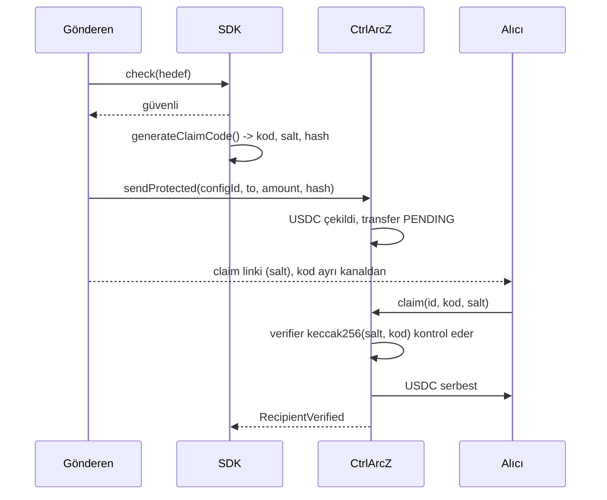

<table>
<tr>
<td width="33%">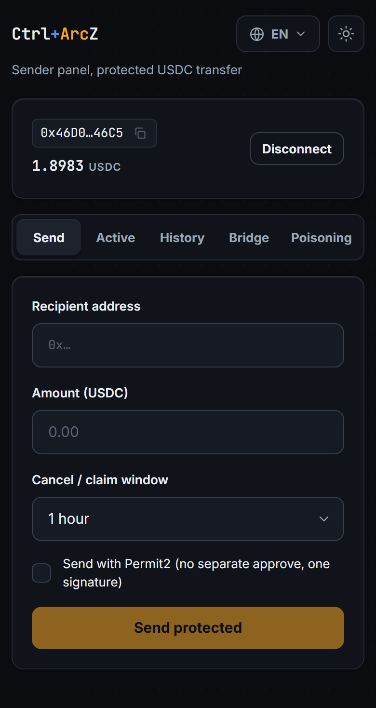</td>
<td width="33%">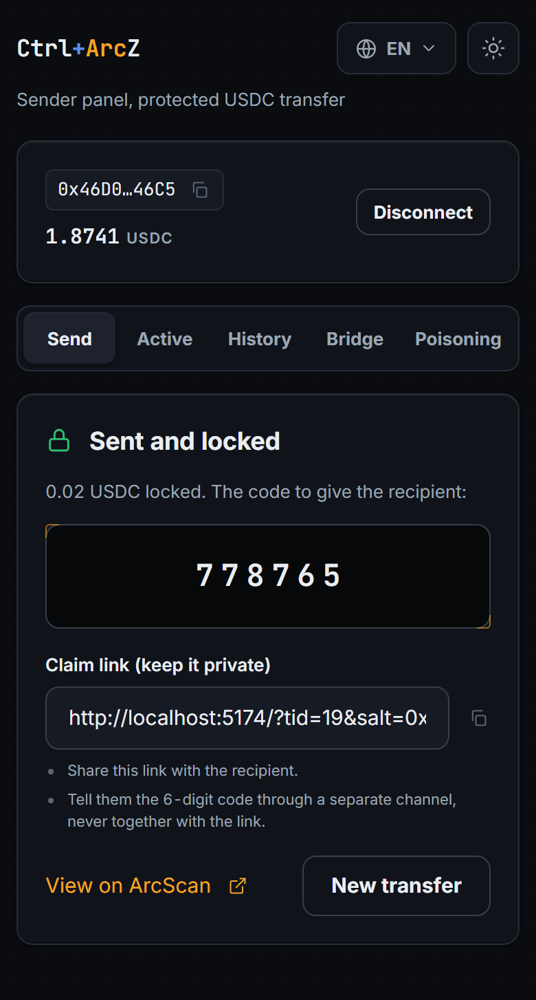</td>
<td width="33%">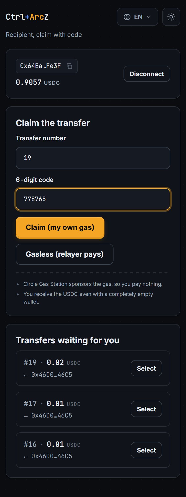</td>
</tr>
<tr>
<td>Alıcıyı yapıştırın. Firewall siz yazarken, debounce ile çalışır.</td>
<td>Para kilitlendi. Link salt'ı taşır, kod sözlü iletilir.</td>
<td>Alıcı claim eder: kendi gas'ıyla ya da relayer ödeyerek.</td>
</tr>
</table>

<p>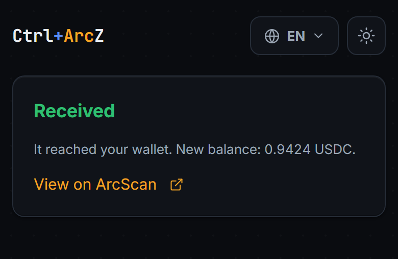</p>

Mutabakat anında olur, çünkü Arc'ta saniye altı deterministik kesinlik var. Alıcının beklemede oturduğu bir arafta yok.

### Senaryo B: firewall reddediyor

Demodaki poisoning sekmesi saldırının tamamını tek tıkla yapar: bu cüzdanın güvendiği bir adresin **gerçek** bir ikizini üretir (ilk ve son dört hex karakter aynı, ortası rastgele), sonra firewall'u ona karşı çalıştırır.

<p>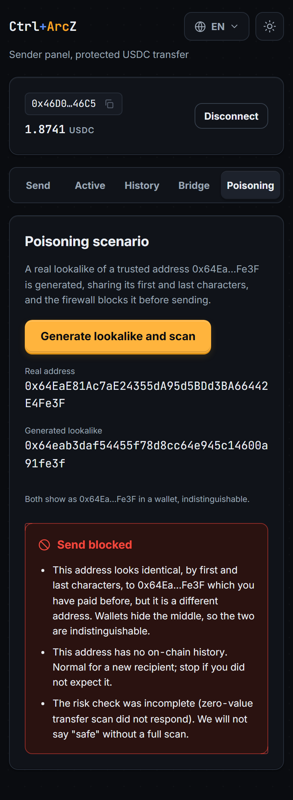</p>

İki adres de herhangi bir cüzdanda `0x64Ea…Fe3F` görünür. Firewall ikincisini bloklar ve gönderim hiç gerçekleşmez.

### Senaryo C: gönderen fikrini değiştiriyor

`cancel`, claim gerçekleşmeden önce her an gönderene açıktır: pencere içinde ya da dışında, hatta yanlış denemelerle donmuş bir transferde bile. Talep edilmemiş para gönderenindir, dolayısıyla geri almanın bir son tarihi yoktur.

<p>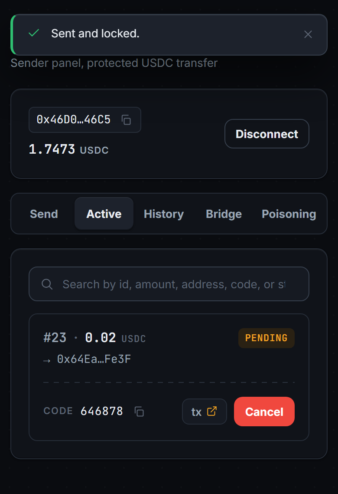</p>

### Senaryo D: alıcı hiç claim etmiyor

Recall penceresi dolduğunda `reclaimExpired` parayı gönderene iade eder. **Herkes** çağırabilir ve para yalnızca gönderene gidebilir. İadeyi otomatik yapan da budur: ortadan kaybolan bir alıcı fonları mahsur bırakamaz ve gönderenin doğru anda çevrimiçi olması gerekmez.

### Senaryo E: alıcının hiç USDC'si yok

Arc'ta gas USDC olduğu için, cüzdanı bomboş yepyeni bir alıcı normalde claim için ödeme yapamaz. `claim` izin gerektirmediği ve parayı her zaman kayıtlı alıcıya ödediği için, bir relayer onu gönderip gas'ı üstlenebilir. Alıcı hiç işlem göndermeden tutarın tamamını alır. Bu zincirde doğrulandı: taze, sıfır bakiyeli, nonce'u 0 olan bir adres transferin tamamını aldı ve nonce'u 0 kaldı.

Demoda claim sunucu tarafında imzalanır, böylece relayer anahtarı tarayıcıya hiç ulaşmaz. Alıcı sadece **Gasless**'a basar.

## USDC'yi Arc'a getirmek: CCTP veya Gateway

Korumalı transfer için Arc'ta USDC gerekir. Circle'ın iki zincirler arası yolu da bağlı ve seçim tek bir sekme.

<table>
<tr>
<td width="50%">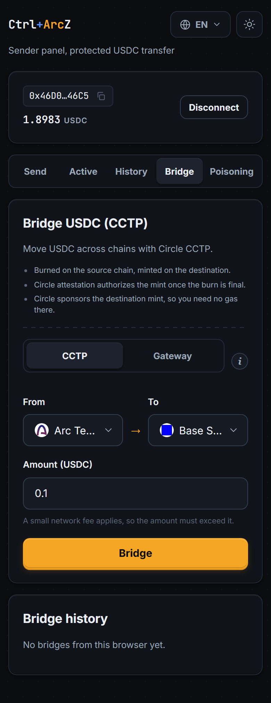</td>
<td width="50%">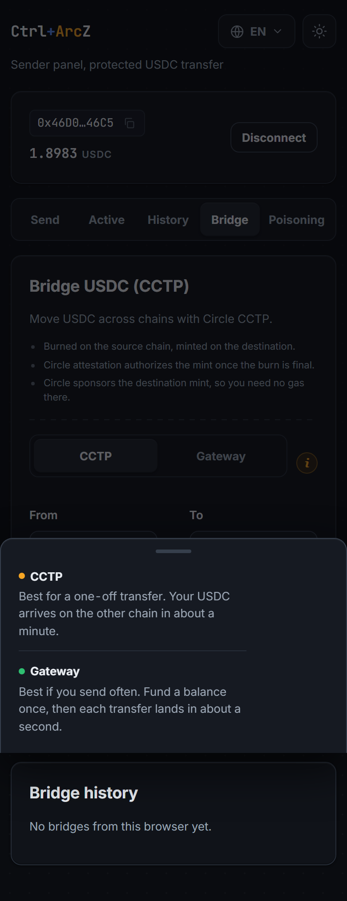</td>
</tr>
<tr>
<td>Yolu, kaynak ve hedef zinciri, tutarı seçin.</td>
<td>Uygulama hangi yolun hangi alışkanlığa uyduğunu açıkça söyler.</td>
</tr>
</table>

|                      | CCTP                              | Gateway                                             |
| -------------------- | --------------------------------- | --------------------------------------------------- |
| Model                | Kaynakta yak, hedefte bas         | Bir kez birleşik bakiyeye yatır, sonra oradan harca |
| İlk transfer         | Yaklaşık bir dakika               | Yatırma, ardından anında harcama                    |
| Tekrarlı transferler | Her seferinde yaklaşık bir dakika | Yaklaşık yarım saniye, yatırma yok                  |
| En uygun             | Tek seferlik taşıma               | Sık gönderim                                        |
| Testnet zinciri      | 11                                | 5                                                   |
| Hedefte gas          | Gerekmez, mint'i Circle iletir    | Gerekmez, mint'i Circle iletir                      |

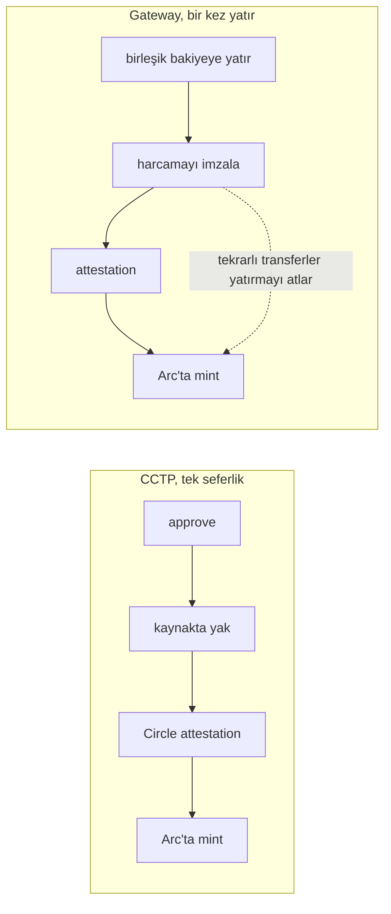

Gateway, CCTP'den daha az zincir destekler; bu yüzden ona geçtiğinizde seçiciler kendini daraltır ve çalışamayacak bir rota önermez.

<table>
<tr>
<td width="50%">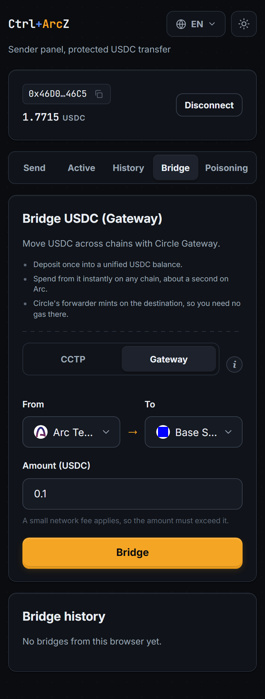</td>
<td width="50%">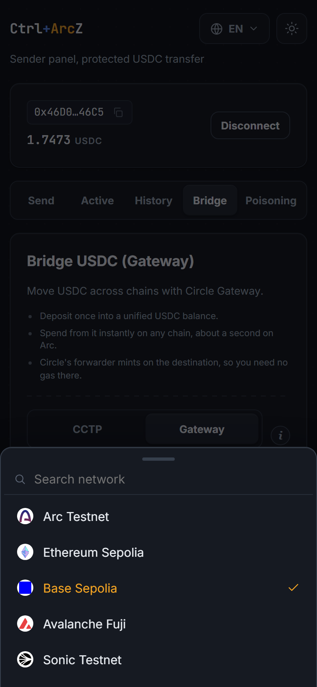</td>
</tr>
<tr>
<td>Gateway seçili. Adım listesi rotaya göre değişir.</td>
<td>Yalnız Gateway'in gerçekten desteklediği zincirler; aranabilir, gerçek ağ logolarıyla.</td>
</tr>
</table>

Her iki rota da demoda **sunucu tarafında** imzalanır (`/api/bridge` ve `/api/gateway`), çünkü Circle'ın Bridge Kit ve Unified Balance Kit'i Node öncelikli ve bir tarayıcı asla imzalama anahtarı tutmamalı. Üretimde entegratör aynı fonksiyonları kendi arka ucundan çalıştırır.

## Neden Arc

Kilitle sonra claim et mekaniği iki işlem gerektirir. Bu mekaniği diğer zincirlerden uzak tutan tam olarak budur ve Arc'ın ortadan kaldırdığı şey de budur.

- **Gas USDC cinsinden, ucuz ve öngörülebilir.** İkinci işlem artık ekonomik ve paranızı hareket ettirmeden önce ayrı bir gas token'ı edinmeniz gerekmiyor.
- **Saniye altı deterministik kesinlik.** Kod girildiği anda transfer sonuçlanır. Alıcı dönen bir çarkı izlemez.
- **Primitifler zaten yerinde.** Permit2 gönderim başına approve'u kaldırıyor. CCTP ve Gateway USDC'yi getiriyor. Circle kendi iade primitifini yayınlamış durumda. Parçalar var; eksik olan reddetmeyi, kilitlemeyi, claim'i ve iadeyi tek akışta birleştiren bir ürün.

## Akıllı kontratlar

| Kontrat               | Adres                                                                                                                          | Rolü                                                     |
| --------------------- | ------------------------------------------------------------------------------------------------------------------------------ | -------------------------------------------------------- |
| **CtrlArcZ**          | [`0x8dAb7148cdc31DAcad6d7e12161AA3DEDb572Dca`](https://testnet.arcscan.app/address/0x8dAb7148cdc31DAcad6d7e12161AA3DEDb572Dca) | Config kaydı, korumalı transferler, doğrulanmış alıcılar |
| **CodeClaimVerifier** | [`0x2C0f268DE2Aa8BB2ab27F2Ea5Ae8a0f9a0E068c4`](https://testnet.arcscan.app/address/0x2C0f268DE2Aa8BB2ab27F2Ea5Ae8a0f9a0E068c4) | `ClaimMode.CODE` için `keccak256(salt, kod)` doğrular    |
| USDC (Arc predeploy)  | `0x3600000000000000000000000000000000000000`                                                                                   | Hem varlık hem gas                                       |

Deploy bloğu `51326557`. Mainnet'e hiçbir şey deploy edilmedi ve edilmeyecek.

| Fonksiyon                                   | Çağıran         | Ne yapar                                              |
| ------------------------------------------- | --------------- | ----------------------------------------------------- |
| `createConfig(pencere, mod, feeBps, feeTo)` | Entegratör      | Bir davranış kaydeder, deterministik `configId` döner |
| `sendProtected(configId, to, amount, hash)` | Gönderen        | USDC'yi bir claim taahhüdüne karşı kilitler           |
| `sendProtectedWithPermit(..., signature)`   | Gönderen        | Aynısı, Permit2 ile çekilir, ayrı approve işlemi yok  |
| `claim(id, kod, salt)`                      | Herkes          | Kayıtlı alıcıya bırakır. Yanlış kodda `false` döner   |
| `cancel(id)`                                | Yalnız gönderen | Claim gerçekleşmeden önce her an parayı geri alır     |
| `reclaimExpired(id)`                        | Herkes          | Süresi dolan transferi iade eder. Yalnızca gönderene  |
| `isVerifiedRecipient(gönderen, alıcı)`      | Herkes          | Katman 3, firewall tarafından okunur                  |

Kontrat **sahipsizdir**: owner yok, pause yok, proxy yok, upgrade yolu yok, kilitli bir transfere dokunabilecek admin fonksiyonu yok. Admin'in drenajlayabildiği bir korumalı transfer kontratı kimseyi korumaz. 61 Foundry testi var; içinde değer korunumu, fee bölüşümü, iptal ve geçerli bir kanıtın yalnızca kayıtlı alıcıya ödeme yaptığı özelliği için fuzz testleri de bulunuyor. Dal kapsamı yüzde 100.

## Güvenlik

Denetimin tamamı [`SECURITY.md`](./SECURITY.md) içinde. Kısa hali:

- **Hiçbir anahtar kod içine gömülü değil.** Her imzalama anahtarı ortam değişkeninden okunur ve iki Vite config'i de, operatör açıkça onaylamadıkça, anahtarı bundle'a gömecek bir production build'i **reddeder**.
- **Köprü ve gasless claim sunucu tarafında imzalanır.** Tarayıcı yalnızca transfer id'sini, kodu ve salt'ı gönderir; relayer veya Circle anahtarını hiç görmez.
- **Firewall kapalı düşer**, veri kaynağı çöktüğünde "iyi görünüyor"a gerilemez.
- **Claim makbuzları kontrat adresine ve tam transfer id'sine bağlanır**, böylece toplu bir makbuzdaki ilgisiz veya kasten yerleştirilmiş bir event, bir kurbanın transferinin sonucunu belirleyemez.
- **Kabul edilen ödünleşim:** bir transferin beş yanlış deneme hakkını herkes yakıp onu dondurabilir. Para kaybolmaz (gönderen iptal edip yeniden gönderir) ve alternatif, yani denemeleri yalnız alıcı için saymak, saldırganın tek kullanımlık adreslerden kodu bedavaya kırmasına izin verirdi.

## Teknoloji

| Katman          | Seçim                                                                |
| --------------- | -------------------------------------------------------------------- |
| Kontrat         | Solidity 0.8.24, Foundry, OpenZeppelin (SafeERC20, ReentrancyGuard)  |
| SDK             | TypeScript, viem, tsup (ESM, CJS ve tipler), vitest                  |
| Risk verisi     | ArcScan (Blockscout REST), `IDataProvider` arayüzü arkasında         |
| Zincirler arası | Bridge Kit ile Circle CCTP, Unified Balance Kit ile Circle Gateway   |
| Gasless         | İzin gerektirmeyen `claim` ve bir relayer. Demoda Circle Gas Station |
| Onaylar         | Permit2, tek imzalı gönderim için                                    |
| Demolar         | React, Vite, `@ctrl-arcz/demo-kit` içinde ortak tasarım sistemi      |

## Depo yapısı

| Yol                  | Ne                                                                        |
| -------------------- | ------------------------------------------------------------------------- |
| `packages/contracts` | `CtrlArcZ.sol`, `CodeClaimVerifier`, `IClaimVerifier`, Foundry testleri   |
| `packages/sdk`       | `@ctrl-arcz/sdk`, entegratörün gerçekten kurduğu şey                      |
| `packages/demo-kit`  | Ortak cüzdan oturumu, tasarım sistemi ve sunucu tarafı köprü yardımcıları |
| `apps/sender`        | Gönderen demosu, port 5173                                                |
| `apps/receiver`      | Alıcı claim sayfası, port 5174                                            |
| `examples`           | Bağımsız bir Node quickstart'ı, çerçevesiz                                |

Her adres, RPC ve chain sabiti tek bir dosyada durur: `packages/sdk/src/chains/arcTestnet.ts`. Foundry deploy script'i ondan üretilen bir JSON dosyasını okur, böylece hiçbir adres iki kez yazılmaz.

## Başlangıç

```bash
git clone --recurse-submodules https://github.com/Farukest/Ctrl-ArcZ.git
cd Ctrl-ArcZ
pnpm install

cp .env.example .env      # tek kullanımlık testnet cüzdanlarını doldur
```

Arc'ta USDC hem gas hem varlık, o yüzden cüzdanları [faucet.circle.com](https://faucet.circle.com) üzerinden Arc Testnet USDC ile fonlayın. Kontrat için Foundry gerekli: <https://getfoundry.sh>

| Komut                 | Ne yapar                                |
| --------------------- | --------------------------------------- |
| `pnpm build`          | Tüm paketleri derler                    |
| `pnpm test`           | Foundry ve vitest                       |
| `pnpm contracts:test` | Yalnız kontrat testleri                 |
| `pnpm deploy:testnet` | `CtrlArcZ`'yi Arc Testnet'e deploy eder |
| `pnpm dev:sender`     | Gönderen demosu, http://localhost:5173  |
| `pnpm dev:receiver`   | Alıcı demosu, http://localhost:5174     |

SDK'yı kullanmak üç çağrı ve firewall istesen de istemesen de onlardan biri:

```ts
import {
  defineConfig,
  registerConfig,
  generateClaimCode,
  approveUsdc,
  sendProtected,
  RiskBlockedError,
} from '@ctrl-arcz/sdk';

const config = defineConfig({ recallWindow: 3600 });
const { configId } = await registerConfig(clients, config);
const secret = generateClaimCode(); // kod, salt, claimHash

await approveUsdc(clients, amount);

try {
  // Katman 1 bu çağrının içinde çalışır. Benzer adres veya 0 değerli yem,
  // tek bir birim USDC kımıldamadan hata fırlatır. Unutulacak ayrı bir çağrı yok.
  const { transferId } = await sendProtected(
    clients,
    { configId, to: recipient, amount, claimHash: secret.claimHash },
    { config },
  );
} catch (e) {
  if (e instanceof RiskBlockedError) showRiskCard(e.report);
  else throw e;
}
```

Alıcı `claim(clients, transferId, code, salt)` ile alır. Gönderen o ana kadar her an `cancel(clients, transferId)` diyebilir. Tüm imzalar ve UI'nizin zaten çektiği raporu nasıl yeniden kullanacağınız: [`packages/sdk/README.md`](./packages/sdk/README.md).

Demolar MetaMask olmadan da çalışır: her app'in klasörüne bir `.env.local` bırakın, cüzdan yerel bir test imzalayıcısı olur ve yine Arc Testnet'e gerçek işlem yayınlar. Bakınız [`.env.example`](./.env.example).

## Bilinen sınırlar

- Kontrat denetlenmedi. Yalnız testnet.
- Firewall tek bir indexer'a (ArcScan) bağlı. Erişilemezse rapor uyarıya, benzer adres elenemiyorsa bloğa düşer. Asla güvenliye düşmez.
- Poisoning senaryosundaki benzer adres, bir keypair grind'i yerine doğrudan üretilir. Firewall kararı yalnız adresten verdiği için, gerçek bir ikizi bloklandığını kanıtlamak adına private key gerekmez.
- Bekleyen bir transferin beş deneme hakkını yakarak herkes onu dondurabilir. Para güvende kalır; gönderen iptal edip yeniden gönderir.
