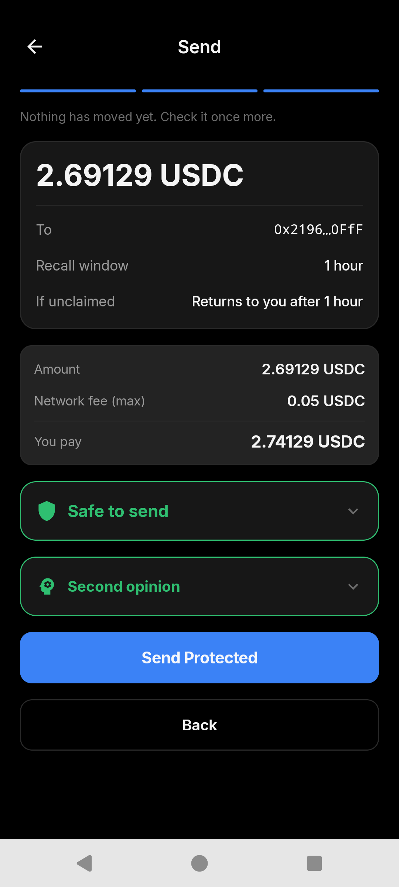
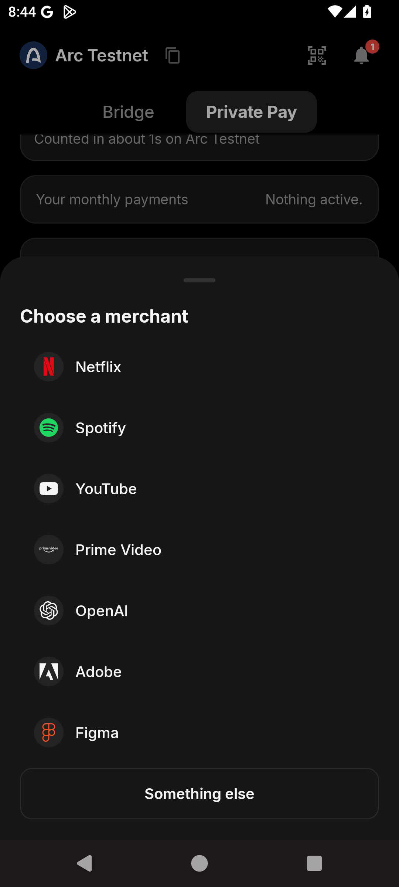
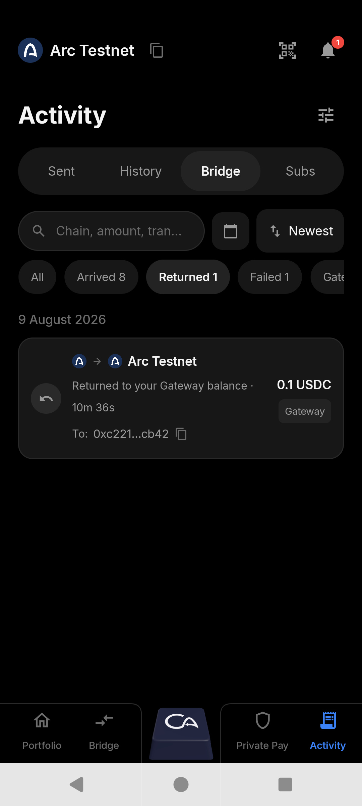
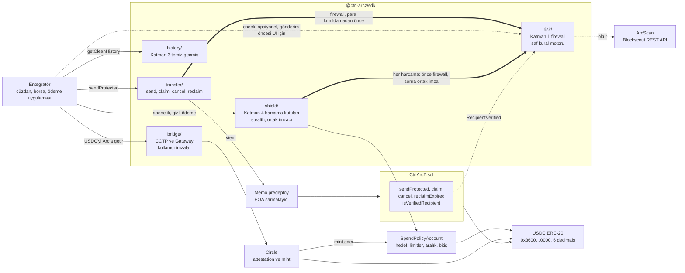
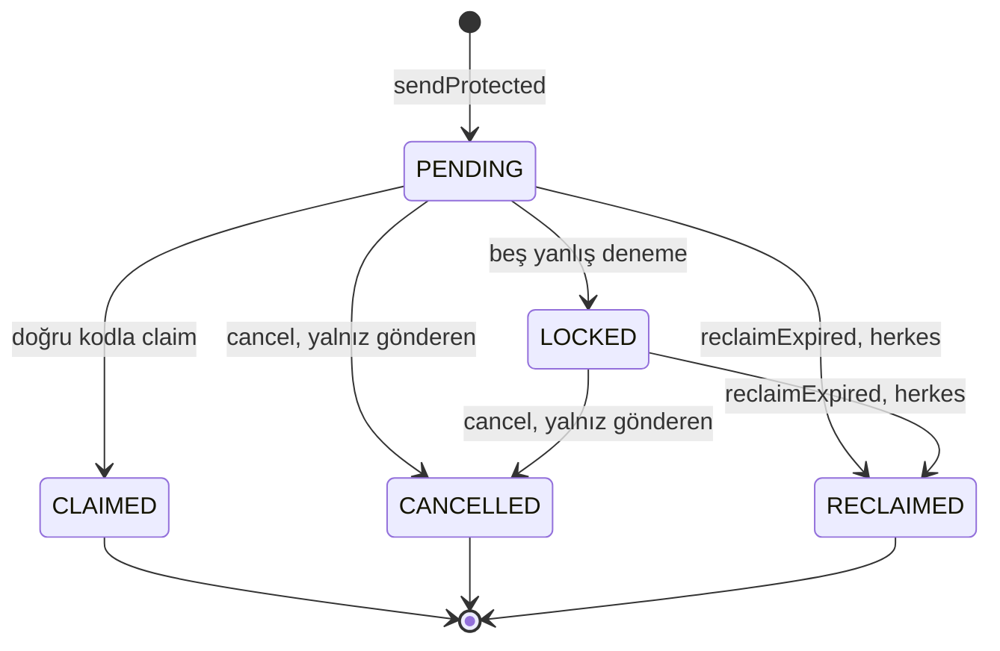
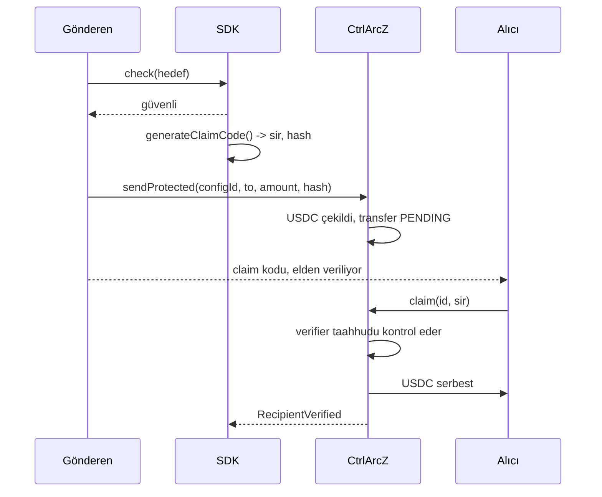
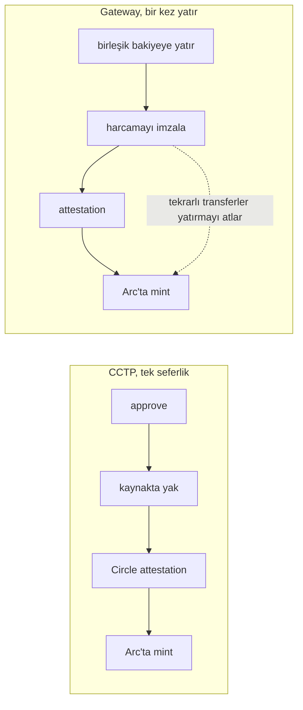

# Ctrl+ArcZ

**İmzalanmadan taranır. Claim edilene kadar geri alınabilir. Cüzdanını vermeden tekrarlanır.**

[](https://www.youtube.com/watch?v=fcgyqBUbkcg) [](https://ctrlarcz.xyz) [](https://www.npmjs.com/package/@ctrl-arcz/sdk) [](https://play.google.com/store/apps/details?id=com.xyz.ctrlarcz) [](https://www.youtube.com/watch?v=DnSkbgBZaM8) [](https://docs.ctrlarcz.xyz) [](https://testnet.arcscan.app/address/0x8dAb7148cdc31DAcad6d7e12161AA3DEDb572Dca) [](#teknoloji) [](#g%C3%BCvenlik)

Arc üzerinde USDC ödemeleri, düz bir transferde olmayan üç şeyle: hiçbir şey imzalanmadan kötü alıcıyı reddeden bir firewall, alıcı paranın kendisine ait olduğunu kanıtlayana kadar gönderenin geri alabildiği bir kilit ve bir satıcının ya da bir ajanın cüzdanınıza hiç dokunmadan tekrar tekrar çekim yapabildiği sınırlı bir harcama kutusu. Tek SDK, tek kontrat, custody yok.

Tek arka uçta üç yüz: **[ctrlarcz.xyz](https://ctrlarcz.xyz)** web uygulaması, **[`@ctrl-arcz/sdk`](https://www.npmjs.com/package/@ctrl-arcz/sdk)** onun arkasındaki motor ve npm'de yayında, **[Android uygulaması](https://play.google.com/store/apps/details?id=com.xyz.ctrlarcz)** ise Google Play'deki native Kotlin istemci. Android uygulaması, SDK'nın sürdüğü aynı `apps/api` uçlarından ve aynı yayınlanmış kontratlardan besleniyor; iki implementasyonu tek bir spesifikasyona `packages/sdk/parity-vectors.json` bağlıyor.

```bash
npm install @ctrl-arcz/sdk viem
```

[English version](./README.md)

## İçindekiler

- [Tek bakışta](#tek-bakışta)
- [Web ve Android: iki istemci](#web-ve-android-iki-istemci)
- [Problem](#problem)
- [Karşılaştırma](#karşılaştırma)
- [Sistem mimarisi](#sistem-mimarisi)
- [Üç katman](#üç-katman)
- [Senaryolara göre akışlar](#senaryolara-göre-akışlar)
- [USDC'yi Arc'a getirmek: CCTP veya Gateway](#usdcyi-arca-getirmek-cctp-veya-gateway)
- [Neden Arc](#neden-arc)
- [Akıllı kontratlar](#akıllı-kontratlar)
- [Güvenlik](#güvenlik)
- [Teknoloji](#teknoloji)
- [Depo yapısı](#depo-yapısı)
- [Başlangıç](#başlangıç)
- [Abonelikler ve ajan cüzdanları](#abonelikler-ve-ajan-cüzdanları)
- [Keeper: zincirle sınırlanmış, cüzdanı olan bir ajan](#keeper-zincirle-sınırlanmış-cüzdanı-olan-bir-ajan)
- [Investigator: bir kuralın veremeyeceği karar](#investigator-bir-kuralın-veremeyeceği-karar)
- [Bilinen sınırlar](#bilinen-sınırlar)

## Tek bakışta

|             |                                                                                                 |
| ----------- | ----------------------------------------------------------------------------------------------- |
| **Ağ**      | Arc Testnet, chain id `5042002`                                                                 |
| **Varlık**  | USDC. Arc'ta hem gas token'ı hem gönderdiğiniz şey                                              |
| **Koruma**  | Gönderim öncesi risk firewall'u, kodla claim, gönderen iptali, süre dolunca otomatik iade       |
| **Custody** | Yok. Para ya kullanıcıda ya kontratta. Owner yok, pause yok, upgrade yolu yok                   |
| **Ürün**    | Herhangi bir cüzdanın, borsanın veya ödeme uygulamasının gömdüğü bir SDK. Yeni bir cüzdan değil |
| **Testler** | Toplam 620: 114 Foundry, 346 SDK, 79 demo-kit, 48 api, 33 keeper, artı canlı testnet koşuları |

## Web ve Android: iki istemci

Aynı kontratı ve aynı API'yi iki tam istemci sürüyor. Web uygulaması SDK'nın referans entegrasyonu. **Android uygulaması bir sarmalayıcı değil, başlı başına bir ürün**: kendi risk motoru, kendi stealth kriptografisi ve kendi CCTP ile Gateway istemcileri olan native bir Kotlin/Compose uygulaması; aynı `apps/api`yi ve aynı yayınlanmış kontratları çağırıyor.

**[Google Play'den indir](https://play.google.com/store/apps/details?id=com.xyz.ctrlarcz)**

| Firewall kararı ve gerçek maliyet | Satıcıya göre abonelik | Parayı geri veren köprü |
| --------------------------------- | ---------------------- | ----------------------- |
|  |  |  |

Tarayıcının yapamadığı üç şey:

**Hiçbir yerde sunucu olmadan bildirim.** Uygulama kontratın olaylarını doğrudan Arc RPC'den okuyor: indeksli alıcı topic'ine göre filtrelenmiş `TransferCreated`, uygulama açıkken 15 saniyede bir, kapalıyken arka plan işiyle. Push servisi yok, kaydolunacak bir yer yok ve kimin hangi adresi izlediğini öğrenen bir sunucu yok. İmleç cihazda duruyor ve teslim edilemeyen bir olay için ilerlemiyor, yani sessizce kaybolan bir şey olmuyor.

**Fotoğraflanmayı reddeden bir ekran.** Claim kodunu gösteren tek ekran `FLAG_SECURE` kuruyor; ekran görüntüsünde de son kullanılanlar listesinde de boş çıkıyor. Kodu saklamanın tek dürüst yolu pano olmadığı için aynı ekran Kopyala, Kaydet ve Paylaş sunuyor ve kaydetmenin bedelini açıkça yazıyor: QR fotoğraflarına iniyor, fotoğraflarını okuyabilen her şey onu da okuyabiliyor.

**İddia edilen değil, test edilen eşitlik.** Gas rezervi hesabı, claim kodu kodlaması, stealth türetimi ve risk kuralları tek bir şartnamenin iki uygulaması. `packages/sdk/scripts/gen-parity-vectors.ts` tarafından üretilen `packages/sdk/parity-vectors.json` hem TypeScript hem Kotlin test takımı tarafından koşuluyor; sapan bir port bir ödemeyi değil bir testi düşürüyor.

Android kaynağı açık değil; vektörlerin burada bir kolaylık olmamasının sebebi tam olarak bu. [`docs/android/ParityVectorsTest.kt`](./docs/android/ParityVectorsTest.kt), o projede koşan Kotlin testinin byte'ı byte'ına kopyası: uygulama kodu yok, anahtar yok, endpoint yok; yalnızca iki uygulamayı tek şartnameye bağlayan doğrulamalar. Okuyamadığın kısım, okuyabildiğin kısma sabitlenmiş durumda. [Neyi kapsıyor ve nasıl doğrulanır](./docs/android/README.md).

## Problem

Bir stablecoin transferi **nihai, kör ve tek seferliktir** ve üzerine kurulan her ürün üçünü de miras alır.

**Nihai.** İmzaladın, gitti. Geri alma yok, itiraz yok, "beklemedeyken iptal et" yok; çünkü bekleme diye bir şey yok. Zincirde para kaybetmenin en yaygın yolu bir hack değil, yanlış bir adres üzerine atılmış doğru bir imza.

**Kör.** Kullanıcıyla zincir arasında, o taahhüt etmeden alıcıyı okuyan hiçbir şey yok. Address poisoning bunun en keskin hâli ve her cüzdanın paylaştığı tek bir ayrıntı yüzünden işliyor: adresler kısaltılarak gösteriliyor, `0x64Ea…Fe3F` gibi. Saldırgan, sizin zaten ödeme yaptığınız bir adresle ilk ve son karakterleri aynı olan bir adres üretiyor, oradan size 0 değerli bir transfer atıp kendini geçmişinize yerleştiriyor ve sizin onu geri kopyalamanızı bekliyor. Belirleyici özellik şu: **kurban yanlış adrese bilerek gönderiyor.** Beklenmedik bir imza yok, kötü niyetli bir kontrat yok, sonrasında anormal davranan hiçbir şey yok. Önce bir dolar gönderme ritüelinin hiçbir şey kanıtlamamasının sebebi bu: test ödemesi de zehirlenmiş adrese gidiyor ve sorunsuz onaylanıyor. Tek başına escrow'un da işe yaramamasının sebebi bu: yanlış alıcı için parayı kilitlemek, parayı saldırgan için kilitlemektir. Bir yerde birinin gönderimi reddetmesi gerekiyor.

**Tek seferlik.** Bir transfer tek bir adrese, bir kez öder. Tekrarlayan her şey, yani abonelik, harçlık, kendi faturasını ödeyen bir ajan, bunun üzerine inşa edilmek zorunda ve normalde inşa edilme yolu iki tane: sınırsız bir token approve'u ya da paylaşılan bir anahtar. İkisi de açık çektir ve ikisi de *bu cüzdan şu satıcıya, şu düzenle ödüyor* cümlesini herkese açık bir deftere kalıcı olarak yazar.

Ctrl+ArcZ üçüne de tek yerde cevap veriyor. Bir firewall, hiçbir şey imzalanmadan kötü alıcıyı reddediyor. Ardından gelen transfer, gönderenin kanaldan elden verdiği bir kodun arkasında kilitleniyor; claim edilene kadar her an geri alınabiliyor ve hiç edilmezse kendiliğinden iade oluyor. Tekrarlayan şey ise politikası zincirde duran bir harcama kutusundan çalışıyor (şu satıcı, şu kadar, şu sıklıkta, şu tarihe kadar) ve o kutunun sahibi tek kullanımlık bir adres, yani zincirin kaydettiği şey bir kutu, bir kişi değil.

Ürünün geri kalanı aynı üç özelliğin başka yerlere uygulanmış hâli: tek kullanımlık bir hesap üzerinden gizli ödeme, aynı kutu üzerinde abonelikler ve ajan cüzdanları, USDC'yi içeri getirmek için CCTP ve Gateway. Hepsi, butonu kurulmadan önce aynı firewall'dan geçiyor.

## Karşılaştırma

İlk iki özellikte kalabalık bir alan var ve temiz ikiye ayrılıyor: sorunu önceden gören araçlar onu durduramıyor, parayı kurtarabilen araçlar ise önce birinin hakemlik etmesini ve parayı tutmasını istiyor.

|                              | Gönderimi durdurur | Sonradan para kurtarılabilir  | Arbiter gerekir | Custody alır | Düz P2P'de çalışır |
| ---------------------------- | ------------------ | ----------------------------- | --------------- | ------------ | ------------------ |
| Cüzdan adres defteri uyarısı | Hayır              | Hayır                         | Hayır           | Hayır        | Evet               |
| Poisoning tespit servisi     | Sadece uyarır      | Hayır                         | Hayır           | Hayır        | Evet               |
| Ticari escrow                | Hayır              | Evet, anlaşmazlık yoluyla     | Evet            | Evet         | Hayır              |
| Circle Refund Protocol       | Hayır              | Evet, aracı yoluyla           | Evet            | Evet         | Hayır              |
| **Ctrl+ArcZ**                | **Evet**\*         | **Evet, gönderen tarafından** | **Hayır**       | **Hayır**    | **Evet**           |

\* Varsayılan olarak bloklar ve gönderimi yalnız arayüzde değil SDK'da da durdurur. Israr eden kullanıcı geçebilir, ama önce iki adrese yan yana bakmak zorundadır ve yanılmışsa para yine geri alınabilir. Bkz. [kaçış kapısı](#katman-1-firewall-hiçbir-şey-imzalanmadan-önce).

Circle'ın Refund Protocol'ü bilinçli olarak farklı bir problemi çözüyor. Bir **arbiter** etrafında kurulu ticari escrow: aracı, lockup penceresini belirliyor ve alıcı satıcı anlaşmazlıklarında iadeyi yetkilendiriyor. Ctrl+ArcZ ise P2P yanlış adres güvenliği: iptal hakkı gönderende, süre dolumu iadesi otomatik ve parayı üçüncü bir taraf hareket ettiremiyor. Araya bir arbiter koymak, korumalı transfer kontratını güvenilir kılan tek özelliği bozardı.

Stablecoin kilitleyen kontratların çoğu ticaret için kurulu: fatura linki, freelance teslimi, marketplace mutabakatı. Hepsi tarafların birbirini tanıdığını ve teslimat üzerine tartıştığını varsayıyor. Yanlış adres güvenliği tam tersini varsayar ve farklı bir şekil ister.

## Sistem mimarisi


```mermaid
flowchart LR
    I["Entegratör<br/>cüzdan, borsa, ödeme uygulaması"]

    subgraph SDK["@ctrl-arcz/sdk"]
        RISK["risk/<br/>Katman 1 firewall<br/>saf kural motoru"]
        TR["transfer/<br/>send, claim, cancel, reclaim"]
        HIST["history/<br/>Katman 3 temiz geçmiş"]
        SHIELD["shield/<br/>Katman 4 harcama kutuları<br/>stealth, ortak imzacı"]
        BRIDGE["bridge/<br/>CCTP ve Gateway<br/>kullanıcı imzalar"]
    end

    SCOUT["ArcScan<br/>Blockscout REST API"]
    MEMO["Memo predeploy<br/>EOA sarmalayıcı"]
    CIRCLE["Circle<br/>attestation ve mint"]

    subgraph C["CtrlArcZ.sol"]
        SM["sendProtected, claim,<br/>cancel, reclaimExpired<br/>isVerifiedRecipient"]
    end

    BOX["SpendPolicyAccount<br/>hedef, limitler, aralık, bitiş"]
    USDC["USDC ERC-20<br/>0x3600…0000, 6 decimals"]

    I -->|sendProtected| TR
    TR ==>|firewall, para kımıldamadan önce| RISK
    I -.->|check, opsiyonel, gönderim öncesi UI için| RISK
    I -->|getCleanHistory| HIST
    I -->|abonelik, gizli ödeme| SHIELD
    I -->|USDC'yi Arc'a getir| BRIDGE
    RISK -.->|okur| SCOUT
    TR -->|viem| MEMO
    MEMO --> C
    C --> USDC
    SHIELD ==>|her harcama: önce firewall, sonra ortak imza| RISK
    SHIELD --> BOX
    BOX --> USDC
    BRIDGE --> CIRCLE
    CIRCLE -->|mint eder| BOX
    CIRCLE --> USDC
    SM -.->|RecipientVerified| RISK
```

Tek deploy, çok kiracı. Entegratör bir kez `createConfig` çağırıp kendi davranışını kodlayan bir `configId` alır: recall penceresi, claim yöntemi, opsiyonel fee, korumaya değer minimum tutar. Bir borsanın çekim ekranı ile bir P2P cüzdanı çok farklı şeyler isteyebilir ve yine de aynı kontratı, aynı SDK'yı kullanır.

## Üç katman

### Katman 1: firewall, hiçbir şey imzalanmadan önce

`check(sender, target)` derecelendirilmiş bir karar döner. Saf bir kural motorudur: aynı girdi her zaman aynı kararı üretir, kararın içinde ağ çağrısı yoktur.

| Kural                | Karar     | Neden                                                                                             |
| -------------------- | --------- | ------------------------------------------------------------------------------------------------- |
| `LOOKALIKE_ADDRESS`  | **block** | Hedef, bu gönderenin gerçekten ödeme yaptığı bir adresle ilk ve son dört hex karakteri paylaşıyor |
| `ZERO_VALUE_BAIT`    | **block** | Hedef, bu gönderene 0 değerli transfer atmış. Birine sıfır token göndermenin başka amacı yok      |
| `FRESH_ADDRESS`      | uyarı     | İlk kez 24 saatten kısa süre önce görüldü. Poisoning adresleri saldırı için taze üretilir         |
| `NEW_ADDRESS`        | uyarı     | Hiç zincir geçmişi yok                                                                            |
| `VERIFIED_RECIPIENT` | güvenli   | Bu adrese daha önce korumalı bir transfer kodla claim edilerek ulaştı                             |
| `KNOWN_COUNTERPARTY` | güvenli   | Bu adrese daha önce ödeme yapıldı                                                                 |

Kural listesinden daha önemli iki özellik var.

**Olumlu bir sinyal bloğu asla ezmez.** Geçen hafta ödeme yaptığınız bir adres, onun ikizini güvenli yapmaz. Saldırının tamamı zaten bu.

**Firewall kapalı düşer.** Gönderenin ödeme geçmişi çekilemezse benzer adres kuralı çalışamamış demektir, dolayısıyla bir ikiz elenemez. Doğrulanmamış bir hedef, kullanıcının tıklayıp geçeceği bir uyarıya düşürülmek yerine bloklanır. Veri kaynağı çöktüğünde trafiği geçiren bir firewall, hiç firewall olmamasından kötüdür; rapor asla sessizce güvenli işaretlenmez.

**Çağırmayı hatırlamanız gerekmiyor.** `sendProtected` taramayı kendisi çalıştırır ve para kımıldamadan `RiskBlockedError` fırlatır; yani SDK'yı kurmak korumalı olmak demektir. Entegratörün unutabileceği ayrı bir çağrı, savunma değildir.

<table>
<tr>
<td width="50%"></td>
<td width="50%"></td>
</tr>
<tr>
<td>Bu cüzdanın ödeme yaptığı bir adresin ikizi. Gönder butonu kurulmuyor.</td>
<td>Kararlar derecelidir; eksik tarama güvenliye yuvarlanmaz, açıkça söylenir.</td>
</tr>
</table>

**Reddedilmek bir çıkmaz sokak değil.** Kural motoru gerçek bir ödeme hakkında yanılabilir: benzer adres kuralı sekiz eşleşen hex karakterden tetikleniyor ve iki alakasız adres bunu tesadüfen paylaşabiliyor, sıfır değer kuralı da size kimin gönderdiğine bakmıyor. Aşılamayan bir blok, uygulamanın bazen iş arkadaşınıza ödeme yapamaması demektir. O yüzden bir geçiş yolu var ve asıl mesele o yolun biçimi. Reddin yanına konmuş bir buton değil, çünkü onu durdurması gereken kişi okumadan basar: kaçış kapısının kendisi **karşılaştırmadır**. İki adres tam hâlleriyle alt alta gösterilir; her iki uçtaki dörder karakter soluklaştırılır, farklı olan orta kısım parlak bırakılır. Çünkü o uçlardaki dörder karakter, her cüzdanın kısaltıp gösterdiği ve saldırganın eşlediği şeyin ta kendisi. Kurbansan görürsün. Yanlış alarmsa bir bakışta geçersin.

Ancak ondan sonra bir onay kutusu, ancak ondan sonra bir buton geliyor. Ve karar SDK'dan da geçmek zorunda: SDK kendi kontrolünü çalıştırıp yeniden tarıyor ve bir bayrak değil, kullanıcının gerçekten baktığı kararı istiyor. Böylece izin başka bir alıcıya taşınamıyor, oturumu aşamıyor ve kullanıcı düşünürken kötüleşen ya da yeni bir gerekçe kazanan bir karara uygulanamıyor. Arayüz, SDK'nın kabul etmediği bir izni veremez.

Yanılmanın bedeli burada, tarayıcının "yine de devam et"indeki gibi sınırsız değil: para claim koduyla korunan kontrata giriyor, gönderen istediği an iptal edebiliyor ve süre dolunca kendiliğinden geri geliyor. Arc testnet'te uçtan uca doğrulandı: benzer adres bloklandı, karşılaştırma üzerinden aşıldı, gönderildi ve gönderene iptal edilerek geri alındı. Geri çağırmanın olmadığı köprüde ise aynı panel bunu açıkça söylüyor.

**Parayı hareket ettiren her yol bunu çalıştırır.** Gönderim, başkasına köprüleme, gizli ödeme ve abonelik yetkilendirmesi; dördü de birinin elle yazdığı bir adresi alır, dolayısıyla dördü de tek bir modülden, tek bir politikaya karşı aynı kontrolü çalıştırır ve cevap gelmeden hiçbiri butonunu kurmaz. Son cümle göründüğünden daha katı: henüz oluşmakta olan bir karar, karar değildir; tarama sürerken butonunu kuran bir ekran, o cevabın durduracağı ödemeyi gönderebilir. Kararı hepsi için aynı kural verdiği için, yeni bir gönderme yolu sessizce daha zayıf bir kapıyla gelemez.

<p></p>

Bir abonelik, bir adrese yapılan tek bir ödeme değil; fonlanmış bir kutudan belirli aralıklarla çekim yapma iznidir. Yani adres burada her yerden daha çok önemli. Karar siz yazarken alanın altına düşer ve oluştur butonu hiç kurulmaz.

### Katman 2: korumalı transfer

Para kontratta kilitlenir ve yalnız alıcının elindeki bir kanıt karşılığında serbest bırakılır.


```mermaid
stateDiagram-v2
    [*] --> PENDING: sendProtected
    PENDING --> CLAIMED: doğru kodla claim
    PENDING --> LOCKED: beş yanlış deneme
    PENDING --> CANCELLED: cancel, yalnız gönderen
    LOCKED --> CANCELLED: cancel, yalnız gönderen
    PENDING --> RECLAIMED: reclaimExpired, herkes
    LOCKED --> RECLAIMED: reclaimExpired, herkes
    CLAIMED --> [*]
    CANCELLED --> [*]
    RECLAIMED --> [*]
```

Kanıt **80 bitlik tek bir koddur**: gönderenin alıcıya elden verdiği on altı karakter, `A4K7-9QMX-2PR6-TH8D` gibi. Zincir yalnızca bunun hash'ini görür.

Bu biçimin arkasında iki karar var. **Offline kaba kuvvete dayanması gerekiyor**, çünkü zehirlenme saldırısında zincirde kayıtlı alıcı saldırganın kendisidir: hash elindedir ve istediği kadar deneyebilir. Altı haneli bir kod 20 bittir, bir milyon ihtimal, milisaniyelik iş. **Bir de tek parça hâlinde gitmesi gerekiyor.** Kanıtı bölüp yarısını adrese teslim etmek, ister linkte ister zincire yazılmış bir şifreli metinde ister bir backend üzerinden olsun, o yarıyı saldırgana da teslim eder, çünkü adres onundur. Kod, saldırganın içinde olmadığı bir kanaldan bir insana ulaşır; ikinci faktörün tamamı budur.

Alfabe Crockford base32'dir, yani 1 ve 0 ile karışan I, L, O, U harfleri yoktur; alıcının yazdığı değer kontrol edilmeden önce normalize edilir.

Kontratta bilinmesi gereken iki karar var:

**Yanlış kod revert etmez, `false` döner.** Deneme sınırlayıcısı revert eden bir çağrının üzerine kurulamaz, çünkü revert tam da başarısız denemeyi kaydeden sayacı geri alır; denemeler sınırsız, sınırlayıcı da süs olur. Başarısız denemenin kaydedilmesi şart. `claim` bir boolean döner ve denemeyi zincire yazar; beş yanlış deneme transferi dondurur, SDK makbuzu okuyup `WrongClaimCodeError` fırlatır ve madenilen bir işlemi başarılı claim saymaz.

**Claim'i herkes gönderebilir ve para her zaman gönderim anında kaydedilen alıcıya gider.** Bu, claim'i front-run'a karşı güvenli kılar (açığa çıkmış bir kanıtı tekrarlayan biri yalnızca transferi asıl alıcısı için sonuçlandırır) ve gasless yolunu mümkün kılan da budur.

### Katman 3: güvenilecek bir geçmiş

Poisoning yalnızca sahte adres kurbanın geçmişinde durduğu, bir dokunuşla kopyalanabildiği için işliyor. `getCleanHistory` bu yüzeyi iki kuralla yok eder: 0 değerli transferleri düşür ve yalnız bilinen token'ları göster (kampanyalar genelde satırları gerçek bir USDC satırı gibi okunsun diye kendi taklit token'larını basar). Hiçbir şey silinmez; filtrelenen satırlar ayrıca döner, böylece arayüz "spam'i göster" seçeneği sunabilir ve SDK neyi gizlediği konusunda dürüst kalır.

Katman sonra Katman 1'i besler. Sonuçlanan her claim bir `RecipientVerified` yayar ve bu adresler, benzer adres kuralının karşılaştırdığı kümeye eklenir. Birine bir kez korumalı transferle ödeme yapın, firewall o andan itibaren onun ikizini bloklar.

## Senaryolara göre akışlar

### Senaryo A: sonuçlanan korumalı gönderim


```mermaid
sequenceDiagram
    participant S as Gönderen
    participant SDK as SDK
    participant C as CtrlArcZ
    participant R as Alıcı

    S->>SDK: check(hedef)
    SDK-->>S: güvenli
    SDK->>SDK: generateClaimCode() -> sir, hash
    S->>C: sendProtected(configId, to, amount, hash)
    C->>C: USDC çekildi, transfer PENDING
    S-->>R: claim kodu, elden veriliyor
    R->>C: claim(id, sir)
    C->>C: verifier taahhudu kontrol eder
    C->>R: USDC serbest
    C-->>SDK: RecipientVerified
```

<table>
<tr>
<td width="33%"></td>
<td width="33%"></td>
<td width="33%"></td>
</tr>
<tr>
<td>Alıcıyı yapıştırın. Firewall siz yazarken, debounce ile çalışır.</td>
<td>Para kilitlendi. Tek bir kod çıkar ve bir kez gösterilir.</td>
<td>Alıcı claim eder: kendi gas'ıyla ya da gas sponsor edilerek.</td>
</tr>
</table>

<table>
<tr>
<td width="50%"></td>
<td width="50%"></td>
</tr>
<tr>
<td>Alıcının gas tutması hiç gerekmedi: bunu sıfır bakiyeli bir cüzdan, tek bir işlem göndermeden claim etti.</td>
<td>Bu cüzdana şimdiye kadar gönderilen her şey; bu tarayıcıdan değil zincirden okunuyor. Arama, tarih aralığı, günleri gün gibi gruplayan başlıklar ve kopyalanabilir her adres ve işlem.</td>
</tr>
</table>

Alıcının ekrana bakıyor olması gerekmiyor. Gelen bir transfer, kullanıcı hangi ekranda olursa olsun birkaç saniye içinde kendini duyurur; Al tarafındaki rozet de gerçekten claim edilebilecek olanı sayar: süresi dolmuş bir transfer sayılmaz, çünkü ona claim demek yalnızca gas harcayıp revert almak olurdu.

Mutabakat anında olur, çünkü Arc'ta saniye altı deterministik kesinlik var. Alıcının beklemede oturduğu bir arafta yok.

### Senaryo B: firewall reddediyor

Demodaki poisoning sekmesi saldırının tamamını tek tıkla yapar: bu cüzdanın güvendiği bir adresin **gerçek** bir ikizini üretir (ilk ve son dört hex karakter aynı, ortası rastgele), sonra firewall'u ona karşı çalıştırır.

<p></p>

İki adres de herhangi bir cüzdanda `0x64Ea…Fe3F` görünür. Firewall ikincisini bloklar ve gönderim hiç gerçekleşmez.

### Senaryo C: gönderen fikrini değiştiriyor

`cancel`, claim gerçekleşmeden önce her an gönderene açıktır: pencere içinde ya da dışında, hatta yanlış denemelerle donmuş bir transferde bile. Talep edilmemiş para gönderenindir, dolayısıyla geri almanın bir son tarihi yoktur.

<p></p>

### Senaryo D: alıcı hiç claim etmiyor

Recall penceresi dolduğunda `reclaimExpired` parayı gönderene iade eder. **Herkes** çağırabilir ve para yalnızca gönderene gidebilir. İadeyi otomatik yapan da budur: ortadan kaybolan bir alıcı fonları mahsur bırakamaz ve gönderenin doğru anda çevrimiçi olması gerekmez.

Bu buton alıcıda da var. Tanımadığınız birinden gelen, hiç istemediğiniz bir ödeme, alıcı tarafının elinden beklemekten başka bir şey gelmeyen tek durumdu ve çözüm zaten kontratın içindeydi: `reclaimExpired` parayı yalnızca gönderene ödediği için bu butonu herkese vermenin bir maliyeti yok. Satır, sürenin dolduğunu söyler ve geri yollamayı önerir. Kimsenin bakmadığı transferler için aynı butona keeper (`apps/keeper`) belirli aralıklarla basar.

### Senaryo E: alıcının hiç USDC'si yok

Arc'ta gas USDC olduğu için, cüzdanı bomboş yepyeni bir alıcı normalde claim için ödeme yapamaz. `claim` izin gerektirmediği ve parayı her zaman kayıtlı alıcıya ödediği için, bir relayer onu gönderip gas'ı üstlenebilir. Alıcı hiç işlem göndermeden tutarın tamamını alır. Bu zincirde doğrulandı: taze, sıfır bakiyeli, nonce'u 0 olan bir adres transferin tamamını aldı ve nonce'u 0 kaldı.

Alıcı sadece **Gazsız al**'a basar. Claim sunucu tarafında imzalanır, yani ne relayer ne de Circle anahtarı tarayıcıya ulaşır; Circle Gas Station yapılandırılmışsa gas'ı bu projeden kimse ödemez, sponsor edilir. Arc testnet'te ölçüldü: claim EntryPoint v0.7 üzerinden, hiç USDC'si olmayan bir Circle Smart Account'tan geçti, paymaster 0.0062 USDC gas ödedi ve relayer'ın bakiyesi sıfır değişti. Gas Station bilgileri yoksa aynı yol relayer'ın kendi bakiyesinden imzalayıp ödemesine düşer; alıcının deneyimi iki durumda da aynıdır.

## USDC'yi Arc'a getirmek: CCTP veya Gateway

Korumalı transfer için Arc'ta USDC gerekir. Circle'ın iki zincirler arası yolu da bağlı ve seçim tek bir sekme.

<table>
<tr>
<td width="50%"></td>
<td width="50%"></td>
</tr>
<tr>
<td>Yolu, kaynak ve hedef zinciri, tutarı seçin.</td>
<td>Uygulama hangi yolun hangi alışkanlığa uyduğunu açıkça söyler.</td>
</tr>
</table>

|                      | CCTP                              | Gateway                                             |
| -------------------- | --------------------------------- | --------------------------------------------------- |
| Model                | Kaynakta yak, hedefte bas         | Bir kez birleşik bakiyeye yatır, sonra oradan harca |
| İlk transfer         | Yaklaşık bir dakika               | Önce yatırma, sonra harcama                         |
| Tekrarlı transferler | Her seferinde yaklaşık bir dakika | Saniyeler, yatırma yok                              |
| En uygun             | Tek seferlik taşıma               | Sık gönderim                                        |
| Testnet zinciri      | 20                                | 11                                                  |
| Hedefte gas          | Gerekmez, mint'i Circle iletir    | Gerekmez, mint'i Circle iletir                      |


```mermaid
flowchart LR
    subgraph CCTP["CCTP, tek seferlik"]
        A1[approve] --> A2[kaynakta yak] --> A3[Circle attestation] --> A4[Arc'ta mint]
    end
    subgraph GW["Gateway, bir kez yatır"]
        B1[birleşik bakiyeye yatır] --> B2[harcamayı imzala] --> B3[attestation] --> B4[Arc'ta mint]
        B2 -. tekrarlı transferler yatırmayı atlar .-> B4
    end
```

Gateway'in tüm maliyeti yatırmada ve bu maliyet zincirden zincire uçurum kadar farklı: Arc'ta yatırma yaklaşık bir saniyede sayılıyor, Base'ten yapılan yatırma Circle'ın kendi onay sayılarına göre on dokuz dakikaya kadar çıkabiliyor. Uygulama, siz taahhüt etmeden önce hangisi olduğunu söylüyor ve bakiyeniz zaten uygun bir zincirdeyse ucuz olanı öneriyor. Ondan sonrası her zincirden aynı: birkaç saniye, cüzdanınızın hiç işlem yapmadığı bir zincirden bile.

Gateway, CCTP'den daha az zincir destekler; bu yüzden ona geçtiğinizde seçiciler kendini daraltır ve çalışamayacak bir rota önermez.

<table>
<tr>
<td width="50%"></td>
<td width="50%"></td>
</tr>
<tr>
<td>Gateway seçili. Adım listesi rotaya göre değişir.</td>
<td>Yalnız Gateway'in gerçekten desteklediği zincirler; aranabilir, gerçek ağ logolarıyla.</td>
</tr>
</table>

Her iki rota da **kullanıcının kendi cüzdanı** tarafından imzalanır. Bu projede hiçbir bileşen, birinin USDC'sini hareket ettirebilecek bir anahtar tutmaz: burn, Gateway yatırması ve Gateway harcaması cüzdanın ürettiği işlemler ya da EIP-712 imzalarıdır, gerisini Circle'ın attestation servisi yapar. Fonlanacak bir operatör bakiyesi ve custody'sine güvenilecek bir taraf yoktur; yanlış adrese para kaptırmamak üzerine kurulu bir üründe köprünün gönderilmeye değer tek hâli budur.

Bunun bedeli, Circle'ın Node öncelikli kitlerini bir sunucudan çağırmaktan biraz daha fazla iş ve o işi SDK üstleniyor: `packages/sdk/src/bridge` doğrudan CCTP ve Gateway kontratlarıyla ve REST API'leriyle konuşuyor, aynı cüzdandaki iki akış nonce yarışına girmesin diye işlemleri imzalayan başına sıraya alıyor, kaynak zincirin kendi burn'ünü ödeyebildiğini kontrol ediyor ve sayfa yenilense bile takılı kalmış bir transferi CCTP'de burn hash'inden, Gateway'de transfer id'sinden devralabiliyor.

**Ulaşmayan bir transfer kaybolmuş para değildir ve satır bunu söyler.** Gateway harcamasında niyet kabul edildiğinde kaynak zincirde bir burn olmaz: Circle kendi defterinden düşer ve mutabakatı sonra yapar. Yani başarısız bir mint, burn'ün hiç çalışmadığı ve bakiyeden çıkanın bir blokaj olduğu anlamına gelir. Circle onu serbest bırakıyor; ücret dahil, on dakikanın altında iki kez ölçtük. Buna "başarısız" demek, parası yoldayken birine parasının gittiğini söylemek olurdu; o yüzden satır önce `dönüyor`, sonra `döndü` diyor. Circle'ın durumu temelli `failed` kalıyor ve serbest bırakmayı hiç raporlayamıyor, bu yüzden uygulama bunun yerine bakiyeyi izliyor: harcamadan önce not ettiği rakama karşı.

## Neden Arc

Kilitle sonra claim et mekaniği iki işlem gerektirir. Bu mekaniği diğer zincirlerden uzak tutan tam olarak budur ve Arc'ın ortadan kaldırdığı şey de budur.

- **Gas USDC cinsinden, ucuz ve öngörülebilir.** İkinci işlem artık ekonomik ve paranızı hareket ettirmeden önce ayrı bir gas token'ı edinmeniz gerekmiyor.
- **Saniye altı deterministik kesinlik.** Kod girildiği anda transfer sonuçlanır. Alıcı dönen bir çarkı izlemez.
- **Primitifler zaten yerinde.** Permit2 gönderim başına approve'u kaldırıyor. CCTP ve Gateway USDC'yi getiriyor. Circle kendi iade primitifini yayınlamış durumda. Parçalar var; eksik olan reddetmeyi, kilitlemeyi, claim'i ve iadeyi tek akışta birleştiren bir ürün.

## Akıllı kontratlar

| Kontrat               | Adres                                                                                                                          | Rolü                                                     |
| --------------------- | ------------------------------------------------------------------------------------------------------------------------------ | -------------------------------------------------------- |
| **CtrlArcZ**          | [`0x8dAb7148cdc31DAcad6d7e12161AA3DEDb572Dca`](https://testnet.arcscan.app/address/0x8dAb7148cdc31DAcad6d7e12161AA3DEDb572Dca) | Config kaydı, korumalı transferler, doğrulanmış alıcılar |
| **CodeClaimVerifier** | [`0x2C0f268DE2Aa8BB2ab27F2Ea5Ae8a0f9a0E068c4`](https://testnet.arcscan.app/address/0x2C0f268DE2Aa8BB2ab27F2Ea5Ae8a0f9a0E068c4) | `ClaimMode.CODE` için `keccak256(salt, kod)` doğrular    |
| USDC (Arc predeploy)  | `0x3600000000000000000000000000000000000000`                                                                                   | Hem varlık hem gas                                       |

Deploy bloğu `51326557`. Buradaki her şey Arc Testnet. Mainnet, denetimden sonra.

| Fonksiyon                                   | Çağıran         | Ne yapar                                              |
| ------------------------------------------- | --------------- | ----------------------------------------------------- |
| `createConfig(pencere, mod, feeBps, feeTo)` | Entegratör      | Bir davranış kaydeder, deterministik `configId` döner |
| `sendProtected(configId, to, amount, hash)` | Gönderen        | USDC'yi bir claim taahhüdüne karşı kilitler           |
| `sendProtectedWithPermit(..., signature)`   | Gönderen        | Aynısı, Permit2 ile çekilir, ayrı approve işlemi yok  |
| `claim(id, kod, salt)`                      | Herkes          | Kayıtlı alıcıya bırakır. Yanlış kodda `false` döner   |
| `cancel(id)`                                | Yalnız gönderen | Claim gerçekleşmeden önce her an parayı geri alır     |
| `reclaimExpired(id)`                        | Herkes          | Süresi dolan transferi iade eder. Yalnızca gönderene  |
| `isVerifiedRecipient(gönderen, alıcı)`      | Herkes          | Katman 3, firewall tarafından okunur                  |

Kontrat **sahipsizdir**: owner yok, pause yok, proxy yok, upgrade yolu yok, kilitli bir transfere dokunabilecek admin fonksiyonu yok. Admin'in drenajlayabildiği bir korumalı transfer kontratı kimseyi korumaz. Bu kontrat için 63, tüm kontrat paketinde 114 Foundry testi var; içinde değer korunumu, fee bölüşümü, iptal ve geçerli bir kanıtın yalnızca kayıtlı alıcıya ödeme yaptığı özelliği için fuzz testleri de bulunuyor. Bütün kontratlarda kapsam satır, ifade, dal ve fonksiyon olarak yüzde 100; tabloyu `pnpm --filter @ctrl-arcz/contracts coverage` basıyor.

## Güvenlik

Denetimin tamamı [`SECURITY.md`](./SECURITY.md) içinde. Kısa hali:

- **Hiçbir anahtar kod içine gömülü değil.** Her imzalama anahtarı ortam değişkeninden okunur ve iki Vite config'i de, operatör açıkça onaylamadıkça, anahtarı bundle'a gömecek bir production build'i **reddeder**.
- **Kullanıcı adına kullanıcıdan başkası imzalamaz ve sunucuda imzalanan her yolun sınırı zaten zincire yazılıdır.** Korumalı transfer, CCTP burn ve Gateway'in iki ayağı da cüzdanın kendi imzalarıdır. Gasless claim yalnızca gönderim anında kayıtlı olan alıcıya ödeyebilir; tarayıcı yalnızca transfer id'sini, kodu ve salt'ı gönderir, ne relayer ne de Circle anahtarı ona ulaşır. Co-signer bir çekimi yalnızca kutunun kurulduğu politikanın içinde ve yalnızca kutuya kilitlenmiş hedefe yetkilendirebilir, aynı sınırları kutunun kendi kodu da uygular. Relayer kutuları kurar, duyurularını atar ve bir stealth adrese kendi bakiyesinden gas desteği yollar; kullanıcının USDC'sine hiç dokunmaz.
- **Firewall kapalı düşer**, veri kaynağı çöktüğünde "iyi görünüyor"a gerilemez.
- **Parayı hareket ettiren her yol firewall'u çalıştırır**, tek bir modülden, ve hiçbiri karar gelmeden butonunu kurmaz. Dört ekranın bunu kendi başına karara bağlaması, birinin diğerlerinden zayıf bir kapıyla kalmasının yoludur.
- **Claim makbuzları kontrat adresine ve tam transfer id'sine bağlanır**, böylece toplu bir makbuzdaki ilgisiz veya kasten yerleştirilmiş bir event, bir kurbanın transferinin sonucunu belirleyemez.

## Teknoloji

| Katman          | Seçim                                                                |
| --------------- | -------------------------------------------------------------------- |
| Kontrat         | Solidity 0.8.24, Foundry, OpenZeppelin (SafeERC20, ReentrancyGuard)  |
| SDK             | TypeScript, viem, tsup (ESM, CJS ve tipler), vitest                  |
| Risk verisi     | ArcScan (Blockscout REST), `IDataProvider` arayüzü arkasında         |
| Zincirler arası | Circle CCTP ve Circle Gateway; ikisi de kullanıcının cüzdanıyla imzalı |
| Gasless         | İzin gerektirmeyen `claim`, Circle Gas Station sponsorluğu, relayer yedeği |
| Onaylar         | Permit2, tek imzalı gönderim için                                    |
| Uygulamalar     | React, Vite, `@ctrl-arcz/demo-kit` içinde ortak tasarım sistemi       |

Uygulamadaki her geçmiş listesi tek bir bileşen. Gönderilen transferler, düz geçmiş,
gelen transferler, köprüler ve abonelikler; her biri kendi arama kutusunu, kendi
sayfalayıcısını ve satırın nasıl göründüğüne dair kendi fikrini üretmişti ve
kopyaların yaptığı gibi birbirinden ayrılmışlardı: değerlerin yalnızca bazıları
kopyalanabiliyordu, satırların yalnızca bazıları işlemi taşıyordu ve hiçbiri tarihe
göre daraltılamıyordu. `@ctrl-arcz/demo-kit/ui` içindeki `HistoryList` ve
`HistoryRow`, artık beşinin de konuştuğu tek dil; tarih filtresi eklemek beş yerde
değil tek yerde bir değişiklik oldu. Satırı şekillendiren kural: başka bir yere
yapıştıracağın her şey kendi kopyala butonunu taşır, sadece okuyacağın şey taşımaz.
Adres ve işlem hash'i birincisi; iki karakterlik satır numarası ikincisi.

## Depo yapısı

| Yol                  | Ne                                                                        |
| -------------------- | ------------------------------------------------------------------------- |
| `packages/contracts` | `CtrlArcZ.sol`, `CodeClaimVerifier`, `IClaimVerifier`, Foundry testleri   |
| `packages/sdk`       | `@ctrl-arcz/sdk`, entegratörün gerçekten kurduğu şey                      |
| `packages/demo-kit`  | Ortak cüzdan oturumu, tasarım sistemi ve sunucu tarafı yardımcılar        |
| `apps/sender`        | Web uygulaması, port 5173. Gönderme ve alma onun iki modu                 |
| `apps/api`           | Arka uç: ortak imzacı, relayer, gasless claim, keşif, investigator        |
| `apps/keeper`        | Keeper ajanı: süresi dolan transferleri iade eder, sınırlı bir kutudan    |
| `examples`           | Bağımsız bir Node quickstart'ı, çerçevesiz                                |

Android istemcisi, kaynağı açık olmayan ayrı bir native Kotlin/Compose uygulaması.
TypeScript uygulamasına `packages/sdk/parity-vectors.json` ile bağlı ve bu bağı kuran
Kotlin testi burada yayınlanıyor:
[`docs/android/ParityVectorsTest.kt`](./docs/android/ParityVectorsTest.kt).
Bkz. [Web ve Android: iki istemci](#web-ve-android-iki-istemci).

Her adres, RPC ve chain sabiti tek bir dosyada durur: `packages/sdk/src/chains/arcTestnet.ts`. Foundry deploy script'i ondan üretilen bir JSON dosyasını okur, böylece hiçbir adres iki kez yazılmaz.

## Başlangıç

```bash
git clone --recurse-submodules https://github.com/Farukest/Ctrl-ArcZ.git
cd Ctrl-ArcZ
pnpm install

cp .env.example .env      # tek kullanımlık testnet cüzdanlarını doldur
```

Arc'ta USDC hem gas hem varlık, o yüzden cüzdanları [faucet.circle.com](https://faucet.circle.com) üzerinden Arc Testnet USDC ile fonlayın. Kontrat için Foundry gerekli: <https://getfoundry.sh>

| Komut                 | Ne yapar                                    |
| --------------------- | ------------------------------------------- |
| `pnpm build`          | Tüm paketleri derler                        |
| `pnpm test`           | Foundry ve vitest                           |
| `pnpm contracts:test` | Yalnız kontrat testleri                     |
| `pnpm lint`           | Tüm workspace'te ESLint                     |
| `pnpm typecheck`      | Her pakette `tsc --noEmit`                  |
| `pnpm deploy:testnet` | `CtrlArcZ`'yi Arc Testnet'e deploy eder     |
| `pnpm dev:api`        | Arka uç, http://localhost:8787              |
| `pnpm dev:sender`     | Web uygulaması, http://localhost:5173       |

İkisini birden çalıştırın: web uygulaması gasless claim, ortak imzacı, stealth relay
ve investigator için arka uca gidiyor; arka uç ayakta değilse bunlar, gayet sağlıklı
görünen bir sayfadan 404 döner. Arka uç, `CORS_ORIGINS` listesinde olmayan hiçbir
tarayıcı origin'ini kabul etmez; yerel çalıştırma için oraya `http://localhost:5173`
eklemek gerekir, bkz. [`apps/api/.env.example`](./apps/api/.env.example).

SDK'yı kullanmak üç çağrı ve firewall istesen de istemesen de onlardan biri:

```ts
import {
  defineConfig,
  registerConfig,
  generateClaimCode,
  approveUsdc,
  sendProtected,
  RiskBlockedError,
} from '@ctrl-arcz/sdk';

const config = defineConfig({ recallWindow: 3600 });
const { configId } = await registerConfig(clients, config);
const secret = generateClaimCode(); // secret, code, salt, claimHash

await approveUsdc(clients, amount);

try {
  // Katman 1 bu çağrının içinde çalışır. Benzer adres veya 0 değerli yem,
  // tek bir birim USDC kımıldamadan hata fırlatır. Unutulacak ayrı bir çağrı yok.
  const { transferId } = await sendProtected(
    clients,
    { configId, to: recipient, amount, claimHash: secret.claimHash },
    { config },
  );
} catch (e) {
  if (e instanceof RiskBlockedError) showRiskCard(e.report);
  else throw e;
}
```

Alıcı `claim(clients, transferId, code, salt)` ile alır; ikisi de `fromSecret(yazilan)` ile tek koddan türer. Gönderen o ana kadar her an `cancel(clients, transferId)` diyebilir. Tüm imzalar ve UI'nizin zaten çektiği raporu nasıl yeniden kullanacağınız: [`packages/sdk/README.md`](./packages/sdk/README.md).

Demolar MetaMask olmadan da çalışır: her app'in klasörüne bir `.env.local` bırakın, cüzdan yerel bir test imzalayıcısı olur ve yine Arc Testnet'e gerçek işlem yayınlar. Bakınız [`.env.example`](./.env.example).

## Abonelikler ve ajan cüzdanları

Bir kez göndermek kolay. Zor olan, bir şeyin cüzdanınızı ona teslim etmeden *tekrar tekrar* harcayabilmesi. Bir abonelik, bir limit, faturasını kendi ödeyen bir yapay zekâ ajanı: her biri açık çek değil, yenilenen bir bütçe istiyor.

Ctrl+ArcZ bunu **tek kullanımlık harcama kutusu** ile çözüyor. Satıcıya doğrudan ödemiyorsunuz. Zincirde küçük bir hesap açıyor, ona bir bütçe yüklüyor ve içine bir politika kilitliyorsunuz: *yalnız bu satıcı, çekim başına bu kadar, bu sıklıkta, bu tarihe kadar.* Zincir dışındaki ortak imzacı ("The Machine") her çekimi firewall'dan geçiriyor ve politikanın dışındaki hiçbir şeyi imzalamıyor. Kutunun kendi kodu da aynı sınırları uyguluyor; yani ortak imzacının anahtarı sızsa ya da satıcı kötüye kullansa bile bütçeden fazlasını alamıyor, başka bir yere gönderemiyor.

Görünmez kalıyorsunuz (satıcı kutuyu görüyor, cüzdanınızı değil), sınırlı kalıyorsunuz (en kötü ihtimal yüklediğiniz bütçe) ve istediğiniz an iptal edebiliyorsunuz (kutuyu süpürün, para eve döner, çekimler durur).

Ortak imzacı bir kapı bekçisi, kasadar değil. Parayı eve getirmek (`sweepToVault` ya da tarih geçtiyse `sweepExpired`) yalnızca sizin anahtarınızı ister, ortak imzacınınkini asla; yani The Machine çökerse ya da düşman olursa bir çekimi geciktirebilir ama paranızı tutamaz. Rolü canlılık, custody değil: en kötü ihtimalle süpürürsünüz ve abonelik biter. Saat ya da zaman dilimi oyunu da yok, çünkü zincirdeki tavanlar (çekim başına ve toplam) zararı zamandan bağımsız olarak sınırlıyor ve kontrat düz bir UTC blok zaman damgasını saniye cinsinden bir aralıkla karşılaştırıyor.

**Abonelik oluşturun.** Satıcıyı adını yazarak değil listeden seçin, bir adrese yöneltin, sonra insanın kafasındaki iki şeyi söyleyin: her çekim ne kadar ve kaç tane. İsim seçiliyor çünkü yerel bir ayrıntı değil: kutunun stealth duyurusunun içine paketleniyor, yani bir yazım hatası kutuyu diğer her cihaza kadar takip ederdi. Bütçe sorulmuyor, gösteriliyor; çünkü o bir cevap. Yanında Circle'ın kutuyu fonlamak için aldığı ücret ve ikisinin toplamı da duruyor. Abonelik yetkilendirmek bir ödemedir ve uygulamada cüzdandan ne çıkacağını söylemeyen son ödeme ekranı burasıydı.


Form eskiden çekim tavanı, aralık, toplam bütçe ve bitiş tarihini dört bağımsız alan olarak soruyor ve aralarındaki aritmetiği dolduran kişiye bırakıyordu. Kimse "0.1 bütçeye karşı dakikada 0.02" diye düşünmez; "ayda bir, on iki kez" diye düşünür. Bütçeyi hesaplamak yanında sessiz bir hata sınıfını da götürdü: 0.1 bütçeye 0.03'lük çekim üç kez çekiliyor, 0.01 kutuda kalıyor ve bunu ekranda kimse söylemiyordu. "Bütçe en az bir çekim kadar olmalı" hatası da artık düşük ihtimal değil, imkânsız. Kontrat iki durumda da aynı sayıları görüyor.

**Hepsini tek yerden yönetin.** Oluşturduğunuz her kutu, doğrudan zincirden okunur; canlı durum, arama, durum filtreleri, sıralama ve sayfalama ile. Uygulamadaki her geçmiş listesiyle aynı bileşen; tek farkı önemli: bir aboneliğin tarihi *bittiği* tarihtir, bu yüzden tarih filtresi geriye değil ileriye daraltır ("7 gün içinde bitiyor"):


**Kutu başına tam detay.** Ne kadar çekildi, ne kaldı, bir sonraki çekim ne zaman mümkün ve kutunun ArcScan adresi; hepsi canlı:


**İsim tarayıcıyla değil, kutuyla seyahat ediyor.** Kutunun stealth duyurusunun içine paketleniyor; uygulama o duyuruları zaten toplu çektiği için ekstra bir istek maliyeti yok ve her cihazda aynı okunuyor. Eskiden `localStorage`'daydı, yani bir makinede "Netflix" olan abonelik diğer her makinede isimsiz bir adresti ve bir abonelikte zincirden canlı okunmayan tek şey oydu. Tarayıcı yine de anında ve bedava yeniden adlandırabiliyor; o override'ı silmek ismi boşaltmıyor, duyurudaki isme geri dönüyor.

Yukarıdaki her ekran görüntüsü Arc Testnet'te gerçek bir abonelik. Kutular zincirde deploy edilip fonlandı ve iptal gerçekten kutuyu eve süpürüyor. Aynı kutu `MODE_PULL` içinde **ajan cüzdanı** senaryosunu da çalıştırıyor: otonom bir ajana dar kapsamlı tek bir kutu verin, kendi başına işlem yapsın ama politikanın ötesine asla geçemesin.

**Keşif sunulur, teslim edilmez.** Announcer tek ve global bir kayıt defteri ve üzerinde sahip etiketi yok, çünkü olmaması asıl mesele. Yani kendi kutularınızı bulmak, şimdiye kadarki her duyuruyu viewing key'inizle denemek demek; bunu tarayıcıdan yapmak her ziyarette 2.19 milyon bloğu 219 parçalı istekle okumak anlamına geliyordu ve bu aralık günde ~168.000 blok büyüyor. Bu maliyet verinin boyutundan değil sorgunun şeklinden geliyor: on dokuz kaydı bulmak için 219 istek, çünkü `eth_getLogs` blok aralığına göre soruluyor ve Arc bu aralığı 10.000 ile sınırlıyor.

Yerine iki kaynak tek istekte cevap veriyor. `GET /api/announcements` listeyi bir kez geri dolduran ve sonra zinciri takip eden bir indeksten veriyor ve tamamlandığı bloğu da bildiriyor. O erişilemezse, zincirin kendi explorer'ı aynı olayları zaten indekslemiş durumda ve blok aralığına göre değil sonuca göre sayfalıyor, yani parçalanacak bir aralık yok. İkisine de kanıtsız güvenilmiyor: indeksin `complete` demesi, explorer'ın ise geri doldurmayı bitirmiş olması ve zincirin 250 bloğu içinde olması gerekiyor. İkisi de cevap veremezse tarayıcı zinciri kendi okuyor. Bu ekranda yavaş kabul edilebilir bir cevap, eksik değil: görünmeyen bir duyuru, görünmeyen fonlu bir kutu demek.

İki yolun hiçbirinde cüzdan adı geçmiyor. Duyuru listesi tasarım gereği yönsüz, factory listesi ise istekte topic olarak değil geldikten sonra cihazda kendi `ownerHash`'inize göre süzülüyor; ne sunucu ne explorer kimin sorduğunu öğreniyor.

Uç nokta hiçbir adres almıyor ve her çağırana aynı baytları dönüyor; iki yanıtın özetini alıp doğruladım. Alması da gerekmiyor: hangi duyurunun size ait olduğunu anlamak viewing key istiyor, o anahtar bir cüzdan imzasından türüyor ve tarayıcıdan çıkmıyor, eşleştirme orada yapılıyor. Viewing key kabul eden bir uç nokta yazması daha kısa olurdu ve stealth adreslerin var olma sebebini karşı tarafa devrederdi. İndeks erişilemezse ya da hâlâ dolduruyorsa bunu söylüyor ve tarayıcı yarım bir listeye güvenmek yerine zinciri kendisi okuyor; çünkü eksik bir duyuru eksik bir abonelik demek ve o ekranda bu, hiç aboneliğin olmamasıyla birebir aynı görünür.

**Kutunun sahibi tek kullanımlık bir adres ve ödeyen, kutunun işlemlerinin dışında kalıyor.** Her kutunun sahibi ve kasası taze bir ERC-5564 stealth adresi; öyle duyuruluyor ki yalnızca ödeyenin görüntüleme anahtarı onu yeniden bulabiliyor. Yukarıdaki liste böyle kuruluyor: zincirde ne kimlik var ne de cüzdandan türetilmiş bir etiket. Ödeyeni ele verecek iki işlem relayer üzerinden gidiyor: deploy ve duyuru (`StealthAnnouncer` `msg.sender`'ı indexliyor, yani kendi cüzdanınızdan duyurmak "bu cüzdan bir stealth kutu yaptı" diye yayınlamak olurdu). Bir stealth adresin kendini süpürebilmesi için gereken küçük gas takviyesi de öyle, çünkü onu kendi cüzdanınızdan ödemek tam da stealth adresin var olma sebebi olan bağı yazmak olurdu. Relay edilen çağrıların hiçbiri kullanıcının parasını hareket ettiremiyor.

**Bütçe Circle'dan geliyor, cüzdanınızdan değil.** Fonlama eskiden ödeyenden kutuya sıradan bir transferdi ve o tek satır üstündeki her şeyi çürütüyordu: bir ERC-20 transferinin iki ucu da indexli, yani bir cüzdanın giden transferlerini alıp duyurucunun verisiyle kesiştiren biri, görüntüleme anahtarı olmadan kutuları çıkarabiliyordu. Gerçek bir cüzdanda ölçtük: sekiz kutunun sekizi, tek bir yanlış eşleşme yok. Kutu artık bir Circle Gateway mint'iyle fonlanıyor, yani Arc'ın kaydettiği şey Circle'ın minter'ının kutuya ödemesi ve ödeyen o satırda yok. Eski transfere bilinçli olarak bir geri düşüş yolu bırakılmadı; ikinci bir yol, o satırı yazmanın ikinci yoludur ve tam da başka bir şey ters gittiğinde seçilir.

[`docs/privacy.md`](./docs/privacy.md) gerçek bir kutunun etrafındaki her USDC hareketini izliyor ve neyin gizlendiğini, neyin gizlenmediğini tek tek söylüyor.

## Keeper: zincirle sınırlanmış, cüzdanı olan bir ajan

`reclaimExpired` izin gerektirmiyor ve her zaman asıl gönderene ödüyor, yani iade için güvenilen bir tarafa gerek yok; ama "izin gerektirmemek" otomatik olmak demek değil. Biri onu çağırana kadar, claim edilmemiş bir transfer kontratta öylece durur. Keeper (`apps/keeper`) o "biri" ve ajan cüzdanı iddiasının diyagram olmaktan çıktığı yer.

Ona fonlanmış bir cüzdan verilip iyi davranacağına güvenilmiyor. Bu ürünün tekrarlayan her alacaklıya ödediği gibi ödeniyor: politikası zincirde olan, PULL modunda bir `SpendPolicyAccount` üzerinden. Hedef keeper'a kilitli, çekim başına tavan var, asgari aralık var, toplam bütçe var, bitiş tarihi var. Tüm etki alanı, operatörün seçtiği ve zincirden geri okuyabildiği bir sayı; Arc'ta bu sayı harcadığı varlığın kendisiyle ölçülüyor, çünkü gas USDC.

Arc Testnet'te keeper'ın gerçek anahtarıyla doğrulandı: #50 numaralı transferi iade etti ve `TransferReclaimed` olayı `caller` olarak keeper'ı, `sender` olarak asıl göndereni kaydetti; kayıtlı alıcı hiçbir şey almadı. Ardından kendi bütçesine karşı dört saldırı (ortak imzacıdan çekim tavanının on katını istemek, ortak imzacı imzasını taklit etmek, kutuyu kendine süpürmek ve doğru kasaya süpürmek) tek tek reddedildi ve operatör kalanı tek bir `sweepToVault` ile geri aldı. Detaylar ve tam iz: [`apps/keeper/README.md`](./apps/keeper/README.md).

## Investigator: bir kuralın veremeyeceği karar

Firewall her seferinde tek bir soruyu, her seferinde aynı şekilde yanıtlıyor. Güvenilir olmasının sebebi de bu, tavanı da bu: bir iş arkadaşınızın yeni cüzdanı için de, ödemeyi yutacak bir kontrat için de *"bu adresin zincir geçmişi yok"* diyor, çünkü tek bir kuraldan bakınca ikisi aynı. Arc Testnet'ten gerçek bir dosya bu boşluğu açıkça gösteriyor: kurallar CtrlArcZ kontratının kendisini `safe / KNOWN_COUNTERPARTY` olarak derecelendiriyor, çünkü gönderen onunla etkileşime girmiş; oysa `isContract: true` demek, oraya yapılacak düz bir USDC transferinin kaybolması demek.

`POST /api/investigate` bir kuralın birleştiremeyeceği sinyalleri toplayıp bunların neye işaret ettiğini raporluyor. **Yalnızca sıkılaştırabilir.** Her yanıt sunucudan çıkmadan önce kural motorunun kararına kırpılıyor; yani yanlış ya da prompt-injection almış bir cevap iyi bir ödemeyi reddedebilir ama kötü bir ödemeyi onaylayamaz, bir ikizin bloğunu kaldıramaz: elindeki tek işlem `max`. Üstelik opsiyonel: API anahtarı yoksa, zaman aşımında ya da bozuk yanıtta rota değişmemiş kural kararını döner ve uygulama, özellik hiç yokmuş gibi davranır.

## Bilinen sınırlar

- Kontrat denetlenmedi. Yalnız testnet.
- Firewall tek bir indexer'a (ArcScan) bağlı. Erişilemezse rapor uyarıya, benzer adres elenemiyorsa bloğa düşer. Asla güvenliye düşmez.
- Duyuru indeksi tek bir sunucu sürecinin belleğinde duruyor. Yeniden başlatmada bir kez geri dolduruyor ve o bitene kadar tarayıcı zinciri kendisi okuyor. Birden fazla instance ile çalışan bir kurulum bunu ortak bir depoya taşımak ister.
- Keeper, başkasının parasını iade etmek için kendi gas'ını harcar; yani hiç kâr etmez. Teşvikli bir keeper ağı değil, operatörün işlettiği bir hizmettir.
